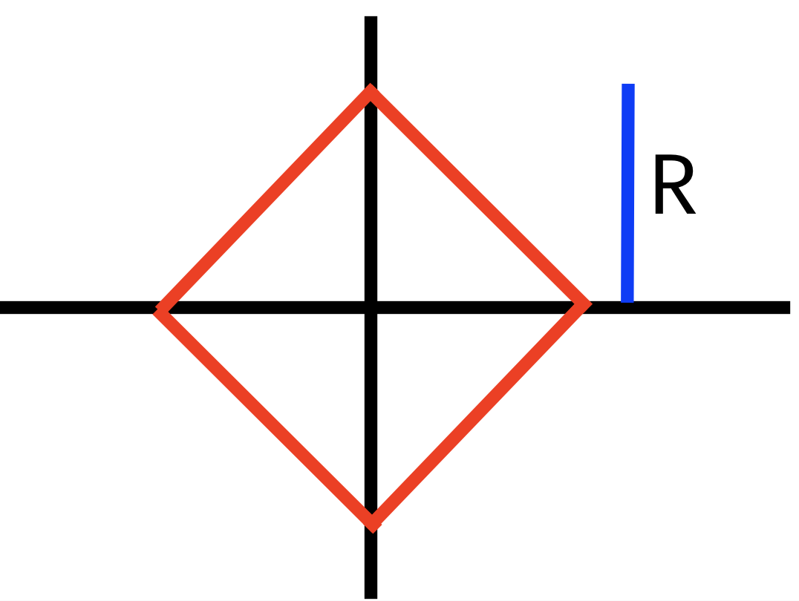

เมื่อกำหนดรัศมี $R$ มาให้ พื้นที่ให้บริการตามเรขาคณิตทั่วไปจะเท่ากับพื้นที่ของวงกลมที่มีรัศมี $R$ นั่นคือ $\pi R^2$ และพื้นที่ให้บริการตามเรขาคณิตแท็กซี่เท่ากับพื้นที่ของสี่เหลี่ยมที่มีทั้งสี่มุมอยู่บนแกน $x$ และแกน $y$ ดังภาพ

ดังนั้นเส้นทะแยงมุมสองเส้นจะอยู่บนแกน x และแกน y โดยที่ความยาวของเส้นทะแยงมุมทั้งสองเส้นเท่ากับ $2R$ ฉนั้นพื้นที่ให้บริการตามเรขาคณิตแท็กซี่เท่ากับ $\frac{1}{2} \times (2R)^2 = 2R^2$

ในการคำนวณ เราสามารถใช้ค่า ```M_PI``` จาก header ```math.h``` หรือ ``cmath`` ได้โดยตรง

```cpp
#include<bits/stdc++.h>	
using namespace std;	
const double PI = 3.14159265358979323846;	

int main() {	  
  double r;	  
  scanf("%lf", &r);	  
  printf("%.6lf\n%.6lf", PI*r*r, 2*r*r);	  
  return 0;	
}
```
