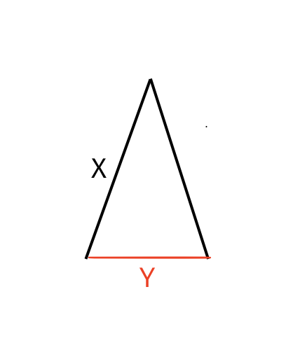

ถ้ากบกระโดดเป็นระยะทางครั้งละ $X$ หน่วยไปยังจุดหมายที่ห่างออกไป $Y$ หน่วย จะมีความเป็นไปได้ 2 กรณีหลัก ๆ 
1. ถ้า $X > Y$ กบจะต้องกระโดด $2$ ครั้งเพื่อไปยังจุดหมาย ตามรูป
2. ถ้า $X \le Y$ กบจะสามารถกระโดด $\left\lceil \frac{Y}{X} \right\rceil - 2$ ครั้งไปในทิศทางของ $Y$ และกระโดดอีกกระโดดอีก 2 ครั้งเพื่อไปให้ถึงจุดหมายได้เสมอเนื่องจากระยะห่างที่เหลือในการกระโดดสองครั้งสุดท้ายจะน้อยกว่า $2 \cdot X$



```cpp
#include<bits/stdc++.h>	
using namespace std; 	

int main () {	
  int x, y; 	  
  cin >> x >> y;	  
  if (x > y) cout << "2\n";	  
  else cout << (y + x - 1) / x << "\n";	
  return 0;	
}
```
