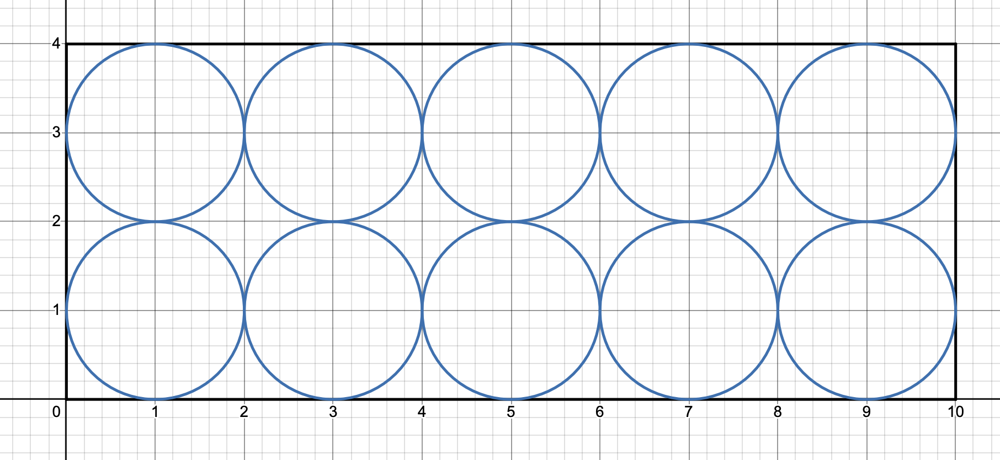
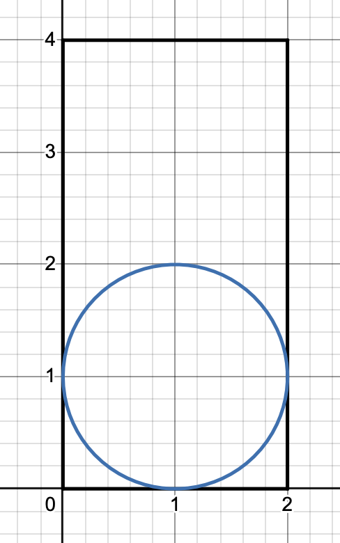
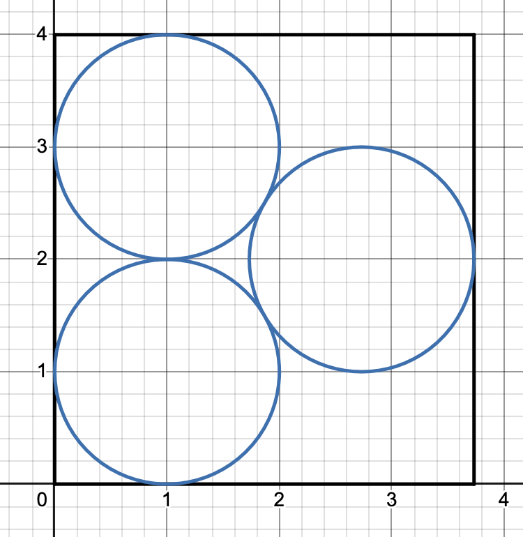
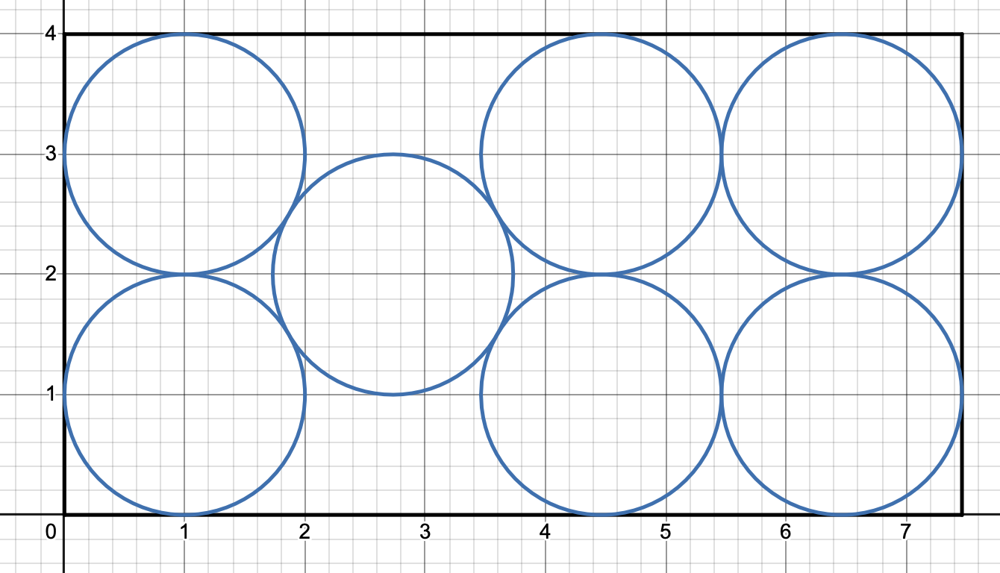

พิจารณาเมื่อ $K$ เป็นเลขคู่ เนื่องจากเส้นผ่านศูนย์กลางของวงกลมแต่ละวงเป็น 2 เราเลยรู้ว่าไม่วิธีที่จะจัดวงกลมมากกว่า $K$ วงลงในพื้นที่สี่เหลี่ยมขนาด $4 \times K$ ตามรูป

ดังนั้นเมื่อให้ $N$ เลขคู่มา คำตอบคือ $K = N$

ส่วนสำหรับ $N$ ที่เป็นเลขคี่จะต้องแยกพิจารณาเป็นสามกรณี 
1. เมื่อ $N = 1$ เราจะได้ว่ารูปที่เล็กที่สุดเป็น $4 \times 2$ ดังรูป

2. เมื่อ $N = 3$ เราจะได้ว่ารูปที่เล็กที่สุดเป็น $4 \times (2 + \sqrt 3)$ ดังรูป

3. เมื่อ $N \ge 5$ เราจะได้ว่ารูปที่เล็กที่สุดเป็น $4 \times (N-3 + 2\sqrt 3)$ ดังรูป


```cpp
int n; cin >> n;
cout << fixed << setprecision(6);
if (n == 1) cout << 2.0;
else if (n == 3) cout << 2 + sqrt(3);
else cout << n + (n&1)*(2*sqrt(3)-3);
```
