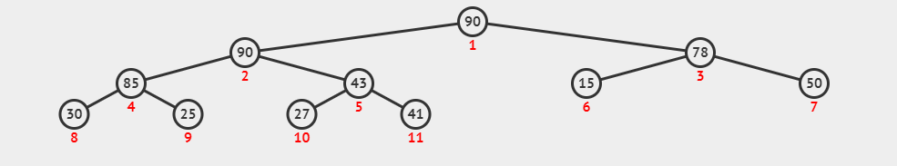
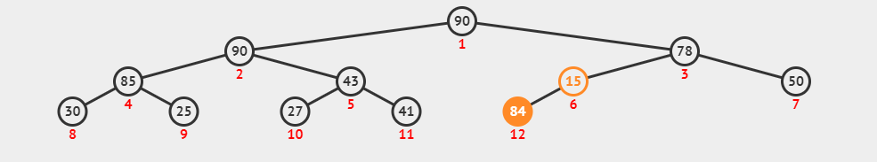
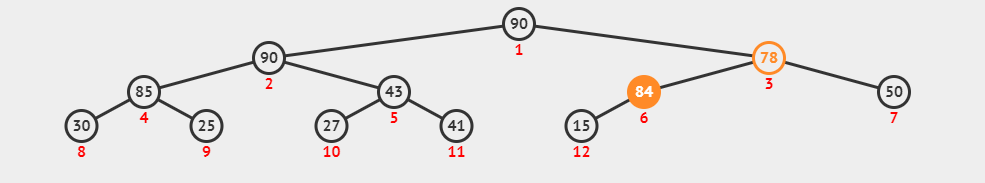
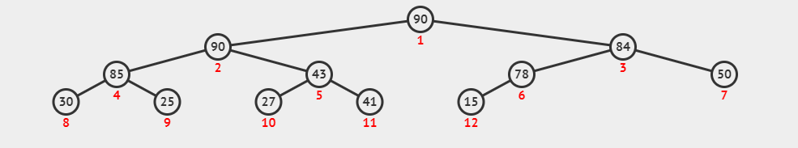
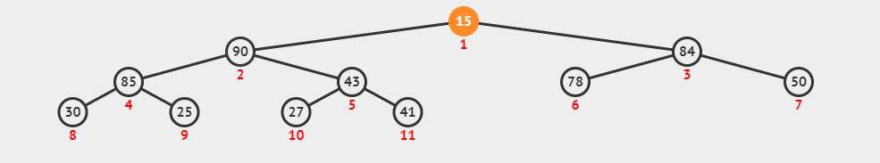
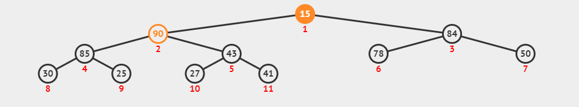
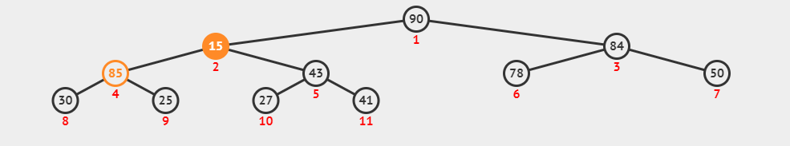
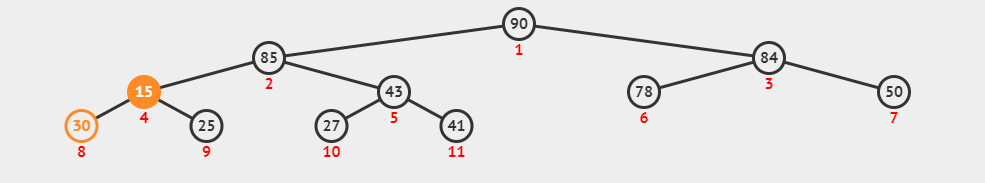
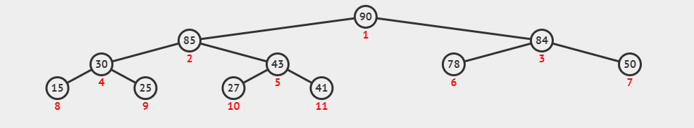

โจทย์ข้อนี้มีคำสั่ง $N$ คำสั่ง โดยคำสั่งจะมีสองแบบ

1. ใส่สินค้ามูลค่า $i$ เข้าไปในเครื่อง
2. ถามว่าสินค้าที่มีมูลค่ามากสุดในเครื่องมีมูลค่าเท่าใดหากมีและเอาออกจากเครื่อง

โจทย์ข้อนี้แก้ได้ด้วย Priority Queue ซึ่งเป็นโครงสร้างข้อมูลที่มีประสิทธิภาพในการหาค่าสูงสุดของชุดข้อมูลที่อาจมีการเพิ่มเข้าหรือลบออก

ทั้งนี้ Priority Queue เป็นโครงสร้างข้อมูลที่มีอยู่ใน STL ซึ่งทำให้ข้อนี้แก้ได้ง่ายมากหากใช้ `std::priority_queue` โดยเพียงต้องใช้ฟังก์ชัน `push` เพื่อคำสั่งประเภทแรก และ `top` กับ `pop` สำหรับคำสั่งประเภทสอง

เนื่องจากโจทย์ข้อนี้เป็นโจทย์ที่ต้องการสอนให้รู้จักการใช้ Priority Queue เฉลยนี้จะอธิบายโครงสร้าง Binary Heap ซึ่งเป็นวิธีที่พื้นฐานที่สุดสำหรับการเขียน Priority Queue (Priority Queue มีความหมายที่กว้างกว่า Binary Heap นอกจาก Binary Heap ยังมีโครงสร้างข้อมูลอื่นที่สามารถใช้เขียน Priority Queue เช่น Fibonacci Heap หรือ Binomial Heap)

## Binary Heap

Binary Heap ที่ต้องการในข้อนี้จะต้องรองรับ Operation สองแบบคือ:
1. Push($i$) ใส่ข้อมูลที่มีค่า $i$ เข้าไปใน Heap
2. Pop() return ค่าสูงสุดใน Heap และเอาข้อมูลนั้นออกจาก Heap 
โดย Operation ทั้งสองมี Time Complexity $\mathcal{O}(\log{}N)$ และการเก็บ Heap มี Memory Complexity $\mathcal{O}(N)$ (เมื่อ $N$ คือขนาดของ Heap)

### หลักการทำงานของ Heap

Heap เป็นโครงสร้างข้อมูลที่เก็บในลักษณะ Complete Binary Tree ซึ่งเป็น Binary Tree ประเภทหนึ่ง

Binary Tree เป็น Tree ที่แต่ละ Node มีลูกอย่างมาก 2 ตัว 

Complete Binary Tree คือ Binary Tree ที่แต่ละชั้นจะมีจำนวน Node มากสุดที่เป็นไปได้ยกเว้นชั้นสุดท้ายซึ่งจะเก็บ Node ไว้ด้านซ้ายสุดก่อน นั่นคือในชั้นที่ $h$ ของ Binary Tree ที่มีชั้น $H$ เป็นชั้นสุดท้าย จะมี Node $2^h$ ตัวหาก $h < H$ และในชั้น $H$ มีได้ตั้งแต่ $1$ ถึง $2^H$ ตัว 

นอกจากนี้ Heap จะรักษาคุณสมบัติว่าสำหรับ Node $x$ ใดๆ ลูกของ Node $x$ จะมีค่าไม่เกินค่าของ Node $x$ ซึ่งจะทำให้ Node รากที่อยู่สูงสุดใน Heap เป็นค่าสูงสุดในทั้ง Heap

ในการ Implement โครงสร้างข้อมูล Binary Heap โดยทั่วไปจะเก็บเป็น Array จากช่องที่ $1$ ถึง $N$ โดยรากอยู่ที่ $1$ และให้ลูกขวาของ Node ที่ช่อง $x$ ที่ช่อง $2x$ และลูกซ้ายอยู่ที่ $2x+1$ (สังเกตตัวเลขแดงในภาพประกอบซึ่งแทนตำแหน่งของแต่ละ Node ใน Array)

เนื่องจาก Binary Heap จัดเป็น Complete Binary Tree จะทำให้จำนวนชั้นของ Heap เป็น $\mathcal{O}(\log N)$ เมื่อ $N$ คือจำนวนสมาชิกใน Heap

#### Push

สำหรับการ Push ค่า $i$ จะใส่ค่า $i$ เข้าไปที่ตำแหน่งซ้ายสุดของชั้นสุดท้ายที่ยังว่าง หากชั้นสุดท้ายเต็มแล้วจะใส่ในช่องซ้ายสุดของชั้นใหม่ จากนั้นจะสลับค่าที่เพิ่งใส่ไปกับ Node พ่อของมันจนกว่ามันมีค่าไม่เกิน Node พ่อ 

เนื่องจากมีเพียง $\mathcal{O}(\log N)$ ชั้น จะมีการสลับอย่างมาก $\mathcal{O}(\log N)$ ครั้ง ซึ่งหมายความว่า Push มี Time Complexity $\mathcal{O}(\log N)$

ตัวอย่างการใส่ 84 เข้าไปใน Heap ตัวอย่างด้านบน

84 มีค่ามากกว่า 15 จึงต้องสลับ

84 มีค่ามากกว่า 78 จึงสลับอีกรอล

84 มีค่าไม่เกิน 90 จึงจบขั้นตอนการ Push

#### Pop

สำหรับการ Pop ค่าที่ต้องการ return คือค่าสูงสุดกล่าวคือค่าที่อยู่ที่ราก 

สำหรับการเอาค่านั้นออกจาก Heap จะสลับ Node ในตำแหน่งขวาสุดของชั้นสุดท้ายมาแทนรากเก่า และสลับ Node ที่ถูกสลับขึ้นมากับลูกที่มีค่ามากสุดจน Node นั้นมีค่าไม่ต่ำกว่าลูกทั้งสอง 

Pop มี Time Complexity $\mathcal{O}(\log N)$ เช่นเดียวกับ Push เนื่องจาก Heap มีเพียง $\mathcal{O}(\log N)$ ชั้น

ตัวอย่างการ Pop จาก Heap ตัวอย่างด้านบน

ค่าที่รากคือ 90 ซึ่งเป็นค่าที่ต้องการ return

สลับ Node ขวาสุดของชั้นสุดท้ายขึ้นมาเป็นรากใหม่

15 มีค่าน้อยกว่า 90 จึงสลับลงไป

15 มีค่าน้อยกว่า 85 จึงสลับลงไปอีก

15 มีค่าน้อยกว่า 30 จึงสลับลงไปอีก

จบขั้นตอนการ Pop เนื่องจากไม่มีลูกให้สลับลงไปอีก

## Solution

เมื่อมี Priority Queue แล้วสำหรับแต่ละคำสั่งใน $N$ คำสั่งที่ได้ เพียวต้อง Push สำหรับ P และ Pop สำหรับ Q

แต่ละคำสั่งใช้เวลา $\mathcal{O}(\log{}N)$ ไม่ว่าจะเป็น P หรือ Q ดังนั้น Time Complexity ของข้อนี้คือ $\mathcal{O}(N\log{}N)$ 

ภาพประกอบทำใน https://visualgo.net/en 
