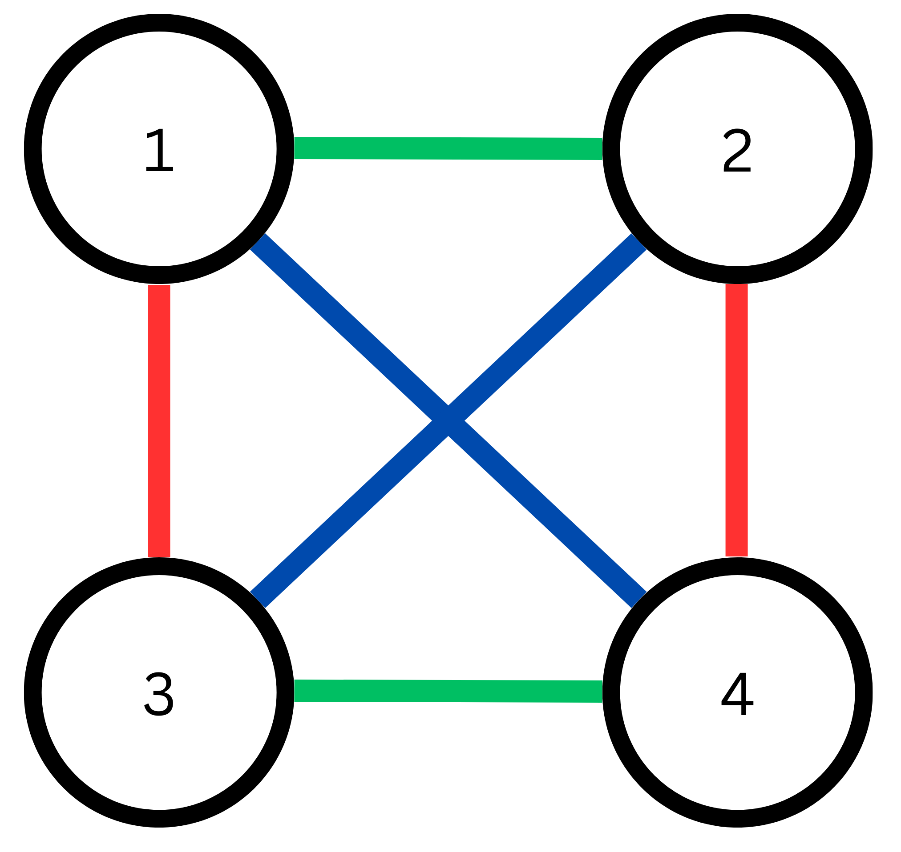

หากแปลโจทย์ข้อนี้เป็นภาษา Graph Theory จะได้คำถามว่าหากมี Node $N$ ตัว (แทนนักเรียน) และ Edge $M$ อัน(แทนความเป็นเพื่อน) จะมีเซ็ตของ Node 4 ตัวกี่เซ็ตที่ใน Subgraph ของ Node 4 ตัวนั้นมี Edge อย่างน้อย 5 อัน

วิธีคิดสำหรับข้อนี้คือพิจารณา Subgraph ขนาด 4 ที่มี 5 หรือ 6 Edge (4 Node จะมีได้อย่างมาก 6 Edge ใน Simple Graph) 

## Adjacency Matrix

ในข้อนี้เราจะต้องการเช็คว่า Node $a$ และ $b$ มี Edge ที่เชื่อมต่อกันไหมในเวลา $\mathcal{O}(1)$ 

โครงสร้างข้อมูลที่เหมาะสมคือ Adjacency Matrix ซึ่งเป็นเป็น Array สองมิติ $A$ ขนาด $N \times N$ โดย $A[a][b]$ จะเป็น $1$ หากมี Edge ดังกล่าวและ $0$ หากไม่มี 

การสร้าง Matrix นี้ใช้เวลาและพื้นที่ความจำ $\mathcal{O}(N^2)$ (เพราะต้องสร้าง Memory ขนาด $N \times N$) 

การอ่านแต่ละ Edge และตั้งค่า $A[X_i][Y_i]$ ให้เป็น $1$ ใช้เวลา $\mathcal{O}(M)$

## Solution

### เคส 6 Edge

สังเกตว่าเราสำหรับ Subgraph ที่เข้าเคส 6 Edge (ซึ่งเป็น Complete Graph) จะต้องมีคู่ Edge ที่ไม่มี Node ร่วมกัน 3 คู่ 

ดังนั้นเมื่อพิจารณาคู่ Edge $((X_i,Y_i), (X_j,Y_j))$ คู่หนึ่งจาก $M$ Edge ที่ได้มาจากข้อมูลนำเข้า โดยทั้งสอง Edge ไม่ได้มี Node ร่วมกัน ใน 4 Node $X_i, Y_i, X_j, Y_j$ หากใน 4 Node นี้มี Edge เชื่อมกันครบ 6 อัน จะสามารถนับว่าเจอ Subgraph เคส 6 Edge ได้ (โดยนับจำนวน Edge ได้โดยตรงด้วยการบวก $A[X_i][Y_i] + A[X_i][X_j] + A[X_i][Y_j] + A[Y_i][X_j] + A[Y_i][Y_j] + A[X_j][Y_j]$ จาก Adjacency Matrix ที่เก็บไว้)

แต่เมื่อนับเช่นนี้จะเกิดการนับซ้ำ 3 รอบ เนื่องจากในแต่ละ Graph ที่เข้าเคสนี้จะมีคู่ Edge ที่ไม่มี Node ร่วมกัน 3 คู่ จึงต้องนำจำนวนที่นับได้มาหาร 3 เพื่อให้ได้จำนวนเคส 6 Edge ที่ต้องการ

### เคส 5 Edge

สำหรับ Subgraph ที่เข้าเคส 5 Edge สังเกตว่าสามารถมองว่าเกิดจากการลบ 1 Edge จากเคส 6 Edge ด้านบน  จะเหลือคู่ Edge ที่ไม่มี Node ร่วมกัน 2 คู่ 

เมื่อพิจารณาคู่ Edge $((X_i,Y_i), (X_j,Y_j))$ คู่หนึ่งที่ไม่มี Node ร่วมกันดังเช่นในเคสก่อนหน้า หากใน 4 Node นี้มี Edge เชื่อมกัน 5 อันพอดี จะสามารถนับว่าเจอ Subgraph เคส 5 Edge ได้ แต่ต้องหาร 2 เพราะจะถูกนับซ้ำสำหรับทั้ง 2 คู่

คำตอบที่ต้องการคือนำจำนวนที่นับได้จากทั้งสองเคสมาบวกกัน 

เนื่องจากมี $M$ Edge จะทำให้มี $\mathcal{O}(M^2)$ คู่ของ Edge ที่ต้องพิจารณา การนับ Edge ใน Subgraph 4 Node ใช้เวลา $\mathcal{O}(1)$ ดังนั้นทั้งปัญหาจึงใช้เวลา $\mathcal{O}(N^2+M^2)$

