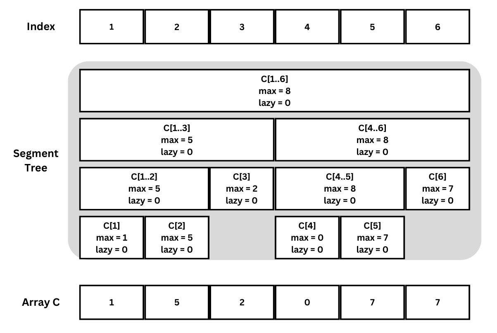
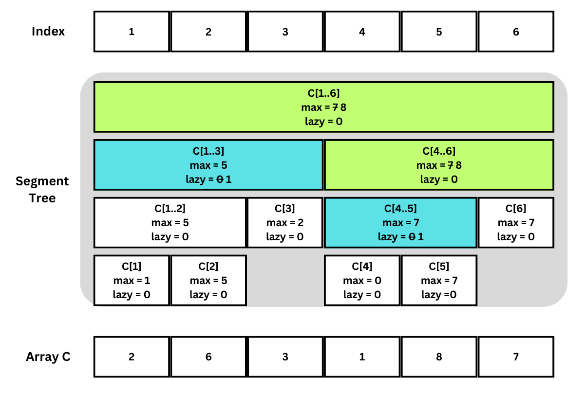
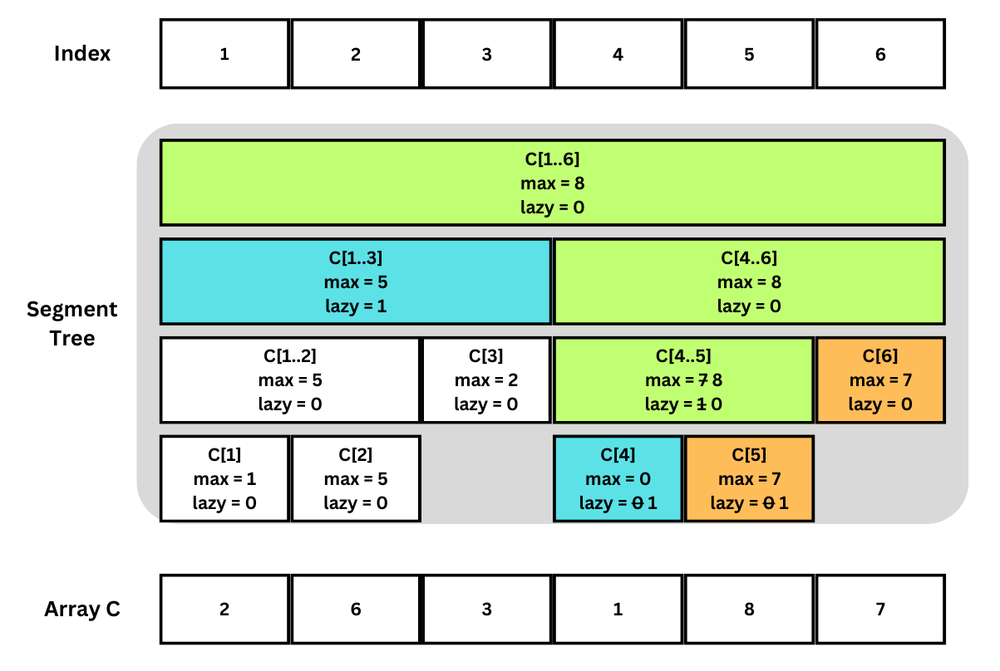

ข้อนี้ให้บริษัทมา $N$ $(N\leq100000)$ บริษัทที่ต้องการจองศูนย์ประชุมซึ่งรองรับได้อย่างมากวันละ $K$ $(K\leq100)$ บริษัท

บริษัท $i$ ต้องการจองศูนย์นี้ระหว่างวันที่ $X_i$ ถึง $Y_i$ $(1\leq X_i\leq Y_i\leq 1000000000)$ โดยการจองจะเรียงจาก $i=1$ ไปถึง $i=N$ หากวันใดมีบริษัทจองครบแล้ว $K$ บริษัท ศูนย์จะเต็มและไม่รับการจองของบริษัทต่อมาที่ขอจองในช่วงที่ทับวันดังกล่าว (กล่าวคือถ้าในช่วง $[X_i,Y_i]$ มีวันใดที่ครบ $K$ แล้วบริษัทที่ $i$ จะไม่ได้จองเลยทั้งช่วง $[X_i,Y_i]$)

### แนวคิด

อย่างแรกสังเกตว่าเราต้องสนใจเพียงวันที่ปรากฎใน $X_i$ หรือ $Y_i$ ใดๆ เป็นพิกัดเพราะหากมีการครบ $K$ วันจะต้องครบที่พิกัดดังกล่าว ดังนั้นสามารถทำ Coordinate Compression (เช่นเดียวกับใน https://programming.in.th/tasks/1138/solution)

ในการพิจารณาแต่ละคำขอจองจากแต่ละบริษัทเราจะต้อง Query ว่าในช่วง $[X_i,Y_i]$ (ที่ทำ Coordinate Compression แล้ว) มีจองไปแล้วกี่บริษัทในวันที่ถูกจองมากที่สุด 

จากนั้นหากยังมีจองไม่ถึง $K$ จะต้อง Update ช่วงนี้ว่ามีจองเพิ่มขึ้น 1 บริษัทสำหรับทุกวันในช่วง $[X_i,Y_i]$

สังเกตว่า Operation ที่เราต้องการมีเพียง Query กับ Update คล้ายกับ Segment Tree เพียงแต่การ Update จะต้องรองรับการ Update ช่วงอย่างมีประสิทธิภาพด้วย โครงสร้างข้อมูลที่รองรับ Operation ดังกล่าวคือ Lazy Segment Tree 

### Lazy Segment Tree

Lazy Segment Tree เป็นโครงสร้าง Segment Tree (อ่านเพิ่มได้จาก https://programming.in.th/tasks/1147/solution) ที่เพิ่มประสิทธิ์ภาพในการ Update แบบช่วง โดยในการ Update แบบช่วงจะเก็บเพิ่มอีกค่าในแต่ละ Node ซึ่งเป็นค่า "Lazy" ที่แทนว่าในทั้งช่วงนี้ยังค้าง Update อะไรอยู่

รูปต่อไปนี้เป็น Lazy Segment Tree ที่เริ่มด้วยค่า Lazy เป็น 0 ทั้งหมด



#### Update

สำหรับการ Update เพิ่มช่วง $[X_i,Y_i]$ ด้วยค่า $Z$ จะคล้ายๆ กับ Segment Tree ปกติ โดยต่างกันเพียงแค่
- ถ้าช่วง $[l,r]$ ที่ Node นี้รับผิดชอบอยู่ใน $[X_i, Y_i]$ จะสามารถเพิ่มค่า Lazy ของ Node นี้ได้แล้ว return เลยโดยไม่ต้องลงไปใน Node ซ้ายหรือยวา
- ถ้า $[l,r]$ ตัดกับ $[X_i, Y_i]$ แต่ไม่ได้อยู่ข้างในทั้งหมดจะต้อง Push ค่า Lazy ไปยัง Node ซ้ายและขวาโดยใช้การ Update ด้วยค่า Lazy ดังกล่าว

ตัวอย่างเช่น



Node สีฟ้าคือ Node ที่ช่วงทั้งช่วง $[l,r]$ อยู่ใน Update ซึ่งจะโดนแก้เพียงค่า Lazy เช่นสำหรับ Node ที่คุมช่วง $C[1..3]$ สังเกตว่าสำหรับ Node เหล่านี้ Node ด้านล่างไม่ถูก Visit เลย

ตัวอย่างโค้ด

```cpp
int update(int X, int Y, int Z, int n, int l, int r) {
  if (X <= l && r <= Y) { // [l,r] is contained in [X,Y]
    Lazy[n] += Z;
    return ST[n] + Lazy[n];
  }
  if (r < X || Y < l) // [X,Y] is not in the range
    return ST[n] + Lazy[n];

  // [l,r] intersects [X,Y]
  push_lazy(n, l, r);

  int mid = (l + r) / 2;
  int new_left_value = update(X, Y, Z, n * 2, l, mid);
  int new_right_value = update(X, Y, Z, n * 2 + 1, mid + 1, r);

  ST[n] = max(new_left_value, new_right_value);
  return ST[n];
}
```

#### Push Lazy
สำหรับการ Push ค่า Lazy เราเพียงต้อง Update Node ลูกซ้ายและขวาด้วยค่า Lazy ปัจจุบัน และแก้ค่า Lazy ให้เป็น $0$ เพื่อแสดงว่าไม่เหลือ Lazy Update ที่ค้างอยู่แล้ว เสร็จแล้วต้อง Update ค่า $\max$ ของช่วงที่เก็บไว้หลัง Update ลูก

ตัวอย่างโค้ด

```cpp
void push_lazy(int n, int l, int r) {
  if (Lazy[n] == 0)
    return;

  int mid = (l + r) / 2;
  int new_left_value = update(l, r, Lazy[n], n * 2, l, mid);
  int new_right_value = update(l, r, Lazy[n], n * 2 + 1, mid + 1, r);
  Lazy[n] = 0;
  ST[n] = max(new_left_value, new_right_value);
}
```

สังเกตว่าในการ Update แต่ละครั้งทุกขั้นตอนรวมถึงการ push_lazy จะใช้เวลา $\mathcal{O}(1)$ ดังนั้น Time Complexity จะเป็นไปตามจำนวน Node ที่ถูก Visit ซึ่งสามารถพิสูจน์ได้จำนวน Node ที่ต้อง Visit จะเป็น $\mathcal{O}(\log N)$ เช่นเดียวกับที่พิสูจน์ไว้แล้วสำหรับ Update ของ Segment Tree ทั่วไปใน https://programming.in.th/tasks/1147/solution

#### Query

สำหรับการ Query จะไม่ต่างกับ Query ของ Segment Tree ปกติมาก โดยเพียวต้องบวกค่า Lazy เข้าไปในค่าที่ Return หาก $[l,r]$ อยู่ในช่วง Query และต้อง push_lazy เช่นเดียวกับการ Update หาก $[l,r]$ ตัดกันช่วง Query แต่ไม่ได้อยู่ข้างในช่วงทั้งหมด

ตัวอย่างประกอบ



ในตัวอย่างนี้ค่าที่ถูก Return คือค่าที่มากสุดของ Node ที่อยู่ในช่วง (Node สีฟ้า) สังเกตว่า Node สำหรับ $C[4]$ กับ $C[5]$ ถูก push_lazy จากค่า Lazy ของ Node $C[4..5]$ 

ตัวอย่างโค้ด
```cpp
int query(int A, int B, int n, int l, int r) {
  if (A <= l && r <= B) // [l,r] is a subset of [a,b]
    return ST[n] + Lazy[n];
  if (B < l || r < A) // [l,r] does not intersect [a,b]
    return -1000000001; // -inf

  // [l,r] intersects [a,b]
  push_lazy(n, l, r);

  int mid = (l + r) / 2;
  int left_query = query(A, B, n * 2, l, mid);
  int right_query = query(A, B, n * 2 + 1, mid + 1, r);

  return max(left_query, right_query);
}
```
การ Query จะใช้เวลา $\mathcal{O}(\log N)$ เช่นเดียวกับการ Update

### Time Complexity

ตามที่อธิบายไว้ด้านบนเราจะทำ Coordinate Compression ที่ใช้เวลา $\mathcal{O}(N\log N)$ แล้วใช้ Lazy Segment Tree สำหรับการ Update และ Query โดยแต่ละ Operation ใช้เวลา $\mathcal{O}(\log N)$ (เพราะจำนวนพิกัดที่ใช้ใน Lazy Segment Tree หลัง Compression คืออย่างมาก $2N$) ซึ่งต้องทำ $N$ ครั้ง จึงใช้เวลาทั้งหมด $\mathcal{O}(N\log N)$ 
