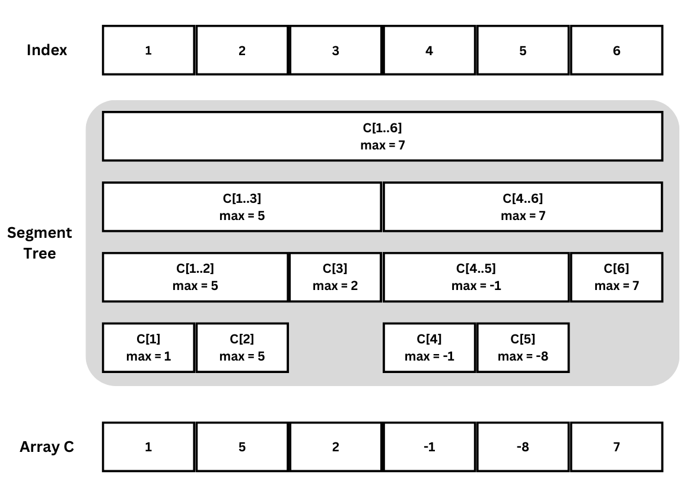
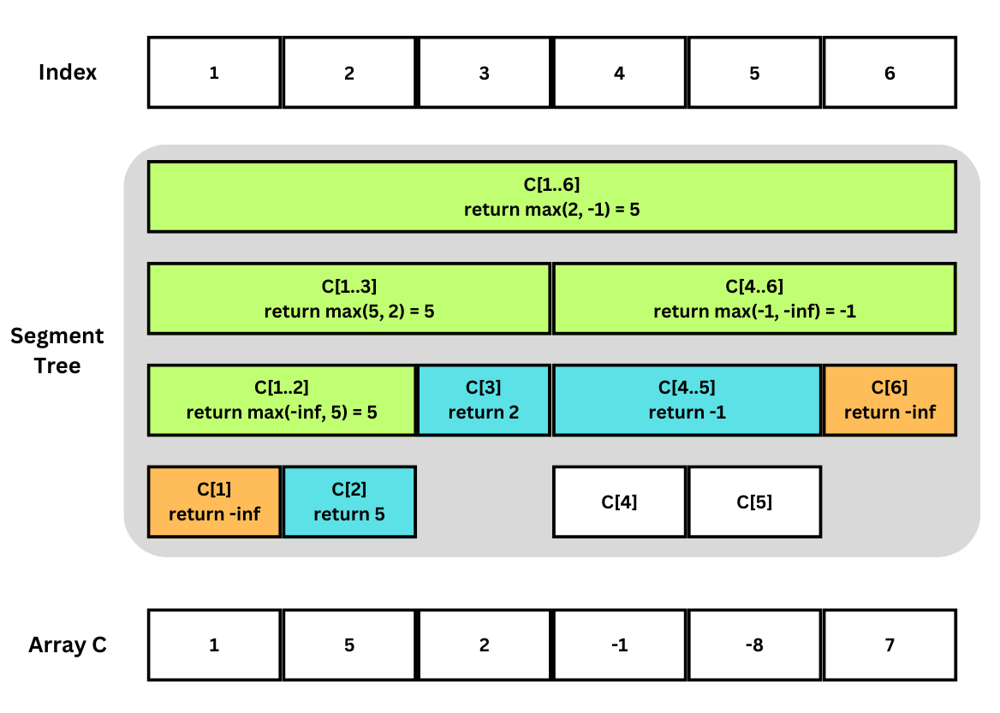
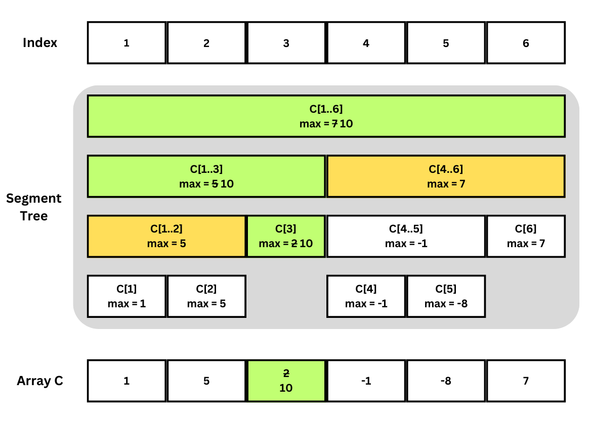

โจทย์ข้อนี้ต้องการให้เขียน Segment Tree ซึ่งเป็นโครงสร้างข้อมูลที่มีประสิทธิภาพในการทำ Range Query (Query แบบช่วง) บน Array โดยเฉพาะในกรณีที่ข้อมูลที่ถูก Query อาจถูก Update

## Segment Tree

สมมุติต้องการทำ Range Query บน Array $C[1..N]$ โครงสร้างข้อมูล Segment Tree จะรองรับ Operation สองแบบคือ:
1. Query($A,B$) หาค่าสูงสุดใน $C[A..B]$
2. Update($i,Z$) เปลี่ยนค่าของ $C[i]$ ให้เป็น $Z$
โดย Operation ทั้งสองมี Time Complexity $\mathcal{O}(\log{}N)$ และใช้ Memory Complexity $\mathcal{O}(N)$

### หลักการทำงานของ Segment Tree

Segment Tree เป็นโครงสร้างข้อมูลที่เก็บในลักษณะ Binary Tree กล่าวคือแต่ละ Node จะมี Child Node ได้อย่างมาก 2 ตัว



แต่ละ Node ของ Segment Tree จะรับผิดชอบข้อมูลในช่วง $C[l..r]$ และจะเก็บค่าสูงสุดในช่วงนั้น โดย Root จะรับผิดชอบทั้ง Array $C[1..N]$ 

Node ที่รับผิดชอบ Subarray ขนาด 1 (กล่าวคือ $l=r$) จะเป็น Leaf Node (ไม่มี Child Node) 

ส่วน Node ที่รับผิดชอบ Subarray ขนาด 2 ขึ้นไปจะมี Child Node 2 ตัว โดย Child Node ซ้ายจะรับผิดชอบช่วง $C[l..mid]$ และ Child Node ขวารับผิดชอบ $C[(mid+1)..r]$ เมื่อ $mid=(l+r)/2$ (ปัดลง)

สังเกตได้ว่าช่วงที่รับผิดชอบของ Node ในแต่ละ Layer ของ Tree จะมีขนาดที่ลดลง (เกือบ) ครึ่งหนึ่งในทุก Layer จึงทำให้ Segment Tree มี Depth อย่างมาก $O(\log{}N)$ นอกจากนี้จำนวน Node ทั้งหมดจะไม่เกิน $2N-1$ เนื่องจากเป็น Binary Tree ที่มี Node $N$ ตัว

#### Query

ในขั้นตอน Query($A$, $B$) สามารถจำแนก Node ที่รับผิดชอบ $C[l..r]$  เป็น 3 เคส คือ

1. $A\leq l \leq r \leq B$ กล่าวคือช่วงที่รับผิดชอบของ Node นี้ทั้งหมดอยู่ใน Query
2. $B < l$ หรือ $r < A$ กล่าวคือช่วงที่ถูก Query ไม่ตัดกับช่วงที่รับผิดชอบของ Node
3. เคสนอกเหนือจาก 1 และ 2 กล่าวคือช่วงที่ถูก Query มีส่วนที่ตัดกับช่วงที่รับผิดชอบของ Node แต่ช่วงของ Node ไม่ได้อยู่ใน Query ทั้งช่วง

เราสามารถเขียน Query หาค่าสูงสุดใน $C[A..B]$ ด้วย Recursive Function บน Node ที่ให้คำตอบว่าค่าสูงสุดในช่วง Query  ที่อยู่ในช่วงที่รับผิดชอบของ Node ที่กำลัง Query (กล่าวคือในช่วง $C[max(l,A)..min(r,B)]$) คือเท่าไหร่ 

หากเริ่ม Query จาก Root จะได้คำตอบของ Query ที่ต้องการว่าค่าสูงสุดใน $C[A..B]$ คือเท่าไหร่เพราะ Root รับผิดชอบทั้ง Array

สำหรับเคส 1 หรือ 2 เมื่อเรียก Query เข้ามีที่ Node นี้จะ return ได้เลย โดยจะ return $max(C[l..r])$ สำหรับเคส 1 และ return $-\infty$ สำหรับเคส 2 

สำหรับเคส 3 จะต้องเรียก Query อีกใน Child Node ทั้งสองฝั่ง และ return ค่ามากสุดที่ได้ 



ภาพประกอบการ Query: Node ที่เข้าเคส 1 เป็นสีฟ้า เคส 2 เป็นสีส้ม เคส 3 เป็นสีเขียว Node สีขาวที่เหลือคือ Node ที่ไม่ถูกเรียก Query

ในเรียก Query แต่ละครั้งจะใช้เวลา $\mathcal{O}(1)$ ในแต่ละ Node เพราะมีเพียงการ return ค่าหรือการทำ $max$ ซึ่งต่างใช้เวลา $\mathcal{O}(1)$ Time Complexity

Node ที่เข้าเคส 3 จะมีได้อย่างมาก Layer ละ 2 Node เพราะ Node ที่เข้าเคส 3 จะต้องมีจุดปลายของ Query ในช่วง $l$ ถึง $r$  และ Query มีเพียงสองจุดปลายคือ $A$ และ $B$ ดังนั้นจึงมีเพียง $\mathcal{O}(\log{}N)$ ตัวที่เข้าเคส 3 เพราะ Segment Tree มี Depth อย่างมาก $O(\log{}N)$

สังเกตว่าทุก Node ในเคส 1 หรือ 2 ที่ถูกเรียก Query จะต้องถูกเรียกมาจากเคส 3 (หรือเป็น Root) จึงได้ว่า การ Query จึงมี Time Complexity $O(\log{}N)$ ตามจำนวน Node ที่เข้าเคสที่ 3

#### Update

สำหรับการ Update($i$, $Z$) สามารถจำแนก Node ที่รับผิดชอบ $C[l..r]$  เป็น 3 เคสเช่นเดียวกับ Query คือ

1. $ l = i = r $ กล่าวคือช่วงที่รับผิดชอบของ Node คือเพียง $C[i]$
2. $B < i$ หรือ $i < A$ กล่าวคือ $C[i]$ ไม่ได้อยุ่ในช่วงที่รับผิดชอบของ Node
3. เคสนอกเหนือจาก 1 และ 2 กล่าวคือ $C[i]$ อยู่ในช่วงที่รับผิดชอบของ Node แต่ Node ไม่ได้รับผิดชอบเพียง $C[i]$

เราสามารถเขียน Update เป็น Recursive Function ที่เริ่มจาก Root เช่นกัน โดย Function นี้จะแก้ไขค่าในแต่ละ Node ที่ถูกเรียกเมื่อแก้ $C[i]$ เป็น $Z$

สำหรับเคส 1 เราจะตั้ง $max(C[i]) = Z$ และ return $Z$

สำหรับเคส 2 เนื่องจากช่วงที่รับผิดชอบไม่ถูกกระทบโดยการเปลี่ยนแปลงค่าที่อยู่นอกช่วงจึงสามารถ return ค่าเดิมคือ $max(C[l..r])$ โดยไม่ต้องแก้ไข

สำหรับเคส 3 จะต้องเรียก Update ใน Child Node ทั้งสองและตั้ง $max(C[l..r])$ เป็น $max$ ของค่าที่ได้จาก Child Node ทั้งสอง


ภาพประกอบการ Update: Node ที่เข้าเคส 1 และ 3 ที่มีการเปลี่ยนแก้ไขเป็นสีเขียว เคส 2 ที่ไม่มีการแก้ไขเป็นสีส้ม

การ Update มี Time Complexity  $O(\log{}N)$ เช่นเดียวกับการ Query และสามารถวิเคราะห์ในรูปแบบเดียวกัน 

### ตัวอย่าง Implementation 

ใน Implementation มาตรฐานของ Segment Tree เราจะให้การ Index ตัว Node คล้าย Heap กล่าวคือสำหรับ Node ที่มี index $n$ จะให้ลูกซ้ายเป็น Node $2n$ และลูกขวาเป็น $2n+1$ (การ Index เช่นนี้จะทำให้ Index สูงสุดอาจถึง $4N$ ไม่ใช่ $2N$ ตามจำนวน Node จริง)

สำหรับ Node $n$ ที่รับผิดชอบ $C[l..r]$ เราจะเก็บค่า $max(C[l..r])$ ใน $S[n]$ 

```cpp
int S[262144 * 4 + 100];

int update(int i, int Z, int n, int l, int r) {
  if (l == i && i == r) { // เคส 1
    S[n] = Z;
    return S[n];
  }
  if (r < i || i < l) // เคส 2
    return S[n];

  // เคส 3
  int mid = (l + r) / 2;
  int new_left_value = update(i, Z, n * 2, l, mid);
  int new_right_value = update(i, Z, n * 2 + 1, mid + 1, r);

  S[n] = max(new_left_value, new_right_value);
  return S[n];
}

int query(int A, int B, int n, int l, int r) {
  if (A <= l && r <= B) // เคส 1
    return S[n];
  if (B < l || r < A) // เคส 2
    return -1000000001; // -inf

  // เคส 3
  int mid = (l + r) / 2;
  int left_query = query(A, B, n * 2, l, mid);
  int right_query = query(A, B, n * 2 + 1, mid + 1, r);

  return max(left_query, right_query);
}
```

## Solution

เมื่อเรามีตัว Segment Tree แล้ว สำหรับโจทย์ข้อนี้เพียงต้องเรียกใช้ update สำหรับคำสั้ง U และ query สำหรับคำสั่ง P

```cpp
int main() {
  int N, Q;
  cin >> N >> Q;
  for (int x = 0; x < Q; x++) {
    char c;
    cin >> c;
    if (c == 'U') {
      int i, Z;
      cin >> i >> Z;
      update(i, Z, 1, 1, N);
    } else {
      int A, B;
      cin >> A >> B;
      cout << query(A, B, 1, 1, N) << "\n";
    }
  }
}
``` 

มีคำสั่ง $Q$ คำสั่ง และแต่ละคำสั่งใช้เวลา ไม่ว่าจะเป็น U หรือ P ดังนั้น Time Complexity ของข้อนี้คือ $\mathcal{O}(Q\log{}N)$