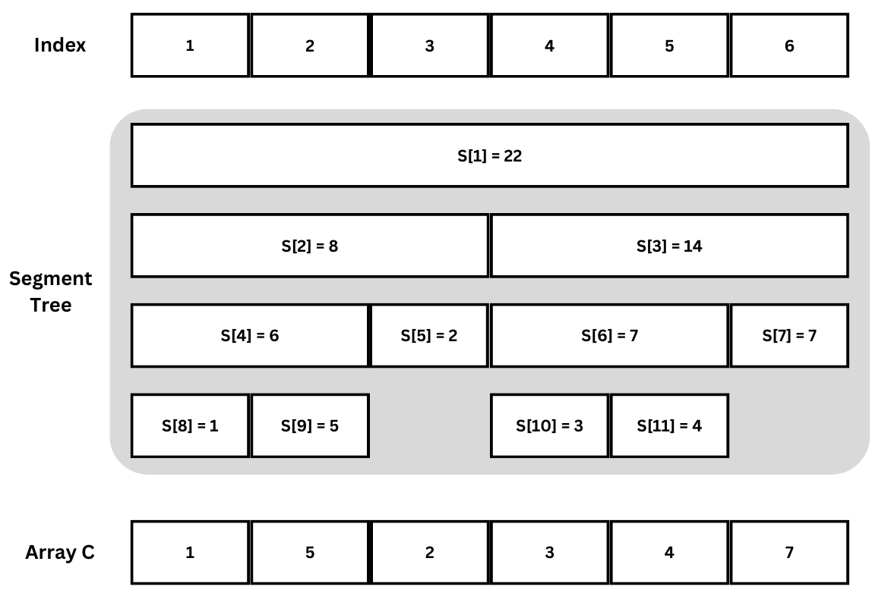
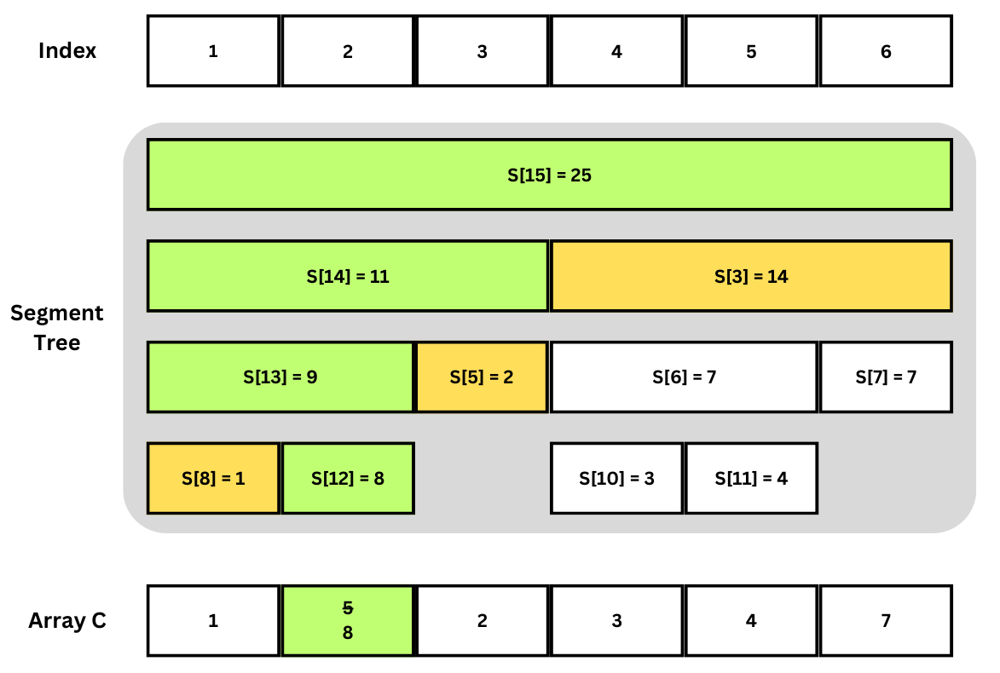

ข้อนี้ให้ลำดับจำนวนเต็ม $N$ $(N \leq 100000)$ ค่า $X[1], X[2], \dots, X[N]$ 

จากนั้นจะมีคำถาม $M$ $(M \leq 50000)$ คำถามมาในรูปแบบจำนวนเต็มสองค่า $s$และ $t$ และจำนวนจริงหนึ่งค่า $u$ แทนคำถามว่าหากจะลบจำนวนใดๆ ก็ได้จาก $X[s..t] = X[s], X[s+1], \dots, X[t]$ จะต้องลบอย่างน้อยกี่ค่าถึงจะทำให้ค่าเฉลี่ยของจำนวนที่เหลือไม่ต่ำกว่า $u$ 

## แนวคิด

แต่ละคำถาม $s, t, u$ สามารถมองเป็นอีกแบบว่าถามว่าจะเก็บไว้ได้มากสุดกี่ค่า ซึ่งเทียบเท่ากับคำถามว่าต้องลบอย่างน้อยกี่ค่า

สังเกตว่าเราควรจะเลือกเก็บค่าที่มากกว่าไว้ก่อนเสมอ เพราะการลบค่าที่น้อยกว่าก่อนค่าสูงกว่าย่อมทำให้ค่าเฉลี่ยสูงขั้น

ดังนั้นเราหากเราเรียง $1, 2, \dots, N$ ใหม่เป็น $idx[1], idx[2], \dots, idx[N]$ ให้ $X[idx[1]] \geq X[idx[2]] \geq \dots \geq X[idx[N]]$ ในคำถามใดๆ วิธีเลือกลบที่ดีสุดจะมีค่า $j$ (โดยอาจมีมากกว่าหนึ่งค่าของ $j$ ที่ได้วิธีเลือกที่ดีสุด) ที่ทุกค่า $X[idx[1]], X[idx[2]], \dots, X[idx[j]]$ ที่อยู่ในช่วง $X[s..t]$ ถูกเก็บไว้ ให้ค่าเฉลี่ยนี้เป็น $Average(s, t, j)$ (กรณี $j=0$ จะแทนว่าไม่สามารถเก็บไว้ได้เลยเพราะต่ำกว่าค่า $u$ ที่ต้องการหมด) 

สำหรับ $X[s], X[s+1], \dots, X[t]$ ใดๆ เมื่อค่า $j$ ลดลง ค่าเฉลี่ยของจำนวนที่เหลืออยู่นี้ย่อมไม่ลดเพราะจะลบค่าต่ำสุดก่อน ในขณะเดียวกันจำนวนที่เก็บไว้ได้ก็ลดลงเช่นกัน ดังนั้นหากเรามีวิธีทำ Query ค่า $Average(s, t, j)$ เราจะสามารถ Binary Search เพื่อหาว่าจะเก็บไว้ได้มากสุดกี่ตัว (เท่ากับต้องลบน้อยสุดกี่ตัว)

สมมิตว่าเรามี Segment Tree ที่ Update ค่าที่ตำแหน่ง $idx[c]$ จาก 0 เป็น $X[idx[c]]$ สำหรับทุก $1 \leq c \leq  j$ แล้ว เราจะสามารถ Query ช่วง $s..t$ หาผลรวม $X[i]$ และหาผลรวมว่า Update ไปกี่ตำแหน่งใน $s..t$ แล้วนำมาหารกันเพื่อให้ได้ $Average(s, t, j)$ ที่ต้องการ แต่การทำแบบนี้สำหรับทุกคำถามจะช้าไปจึงต้องใช้โครงสร้างข้อมูลอื่น

วิธีหนึ่งที่จะรองรับ Query นี้คือการใช้ Persistent Segment Tree ซึ่งสามารถเก็บสถานะของ Segment Tree หลังการ Update ค่า $idx[c]$ ทุกครั้งตั้งแต่ $c=1$ ถึง $c=N$ ใน Persistent Segment Tree การ Query หาค่า $Average(s,t,j)$ เราจะเพียงต้อง Query ในสถานะหลัง Update $idx[j]$ แล้ว

## Persistent Segment Tree

Persistent Segment Tree เป็นโครงสร้างข้อมูล Segment Tree (https://programming.in.th/tasks/1147/solution) ที่เพิ่มคุณสมบัติว่าเป็น Persistent Data Structure นั่นคือโครงสร้างข้อมูลนี้จะไม่ลบสถานะเก่าหลังการ Update ซึ่งทำให้สามารถ Query สถานะเก่าๆ ได้แม้ว่ามีการ Update แล้ว

ใน Persistent Segment นอกจากของที่เก็บในแต่ละ Node แล้ว ยังต้องเก็บดัชนีของลูกขวาและลูกซ้ายเพราะมีการสร้าง Node ใหม่เรื่อยๆ ซึ่งต่างจาก Segment Tree ปกติที่มักให้ลูกซ้ายเป็น `n*2` และขวาเป็น `n*2+1`

สำหรับข้อนี้ค่า $S$ ที่ถูกเก็บจะต้องมีทั้งผลรวม $X[l..r]$ ของช่วงและจำนวนค่าที่ถูก Update แล้วเพื่อใช้เป็นตัวส่วนในการคำนวณค่าเฉลี่ย จึงสามารถใช้ `std::pair` โดยให้เก็บค่าเหล่านี้เป็นค่าแรกและค่าที่สองตามลำดับและประกาศ `operator+` เพื่อความสะดวก

```cpp
pair<long long, int> operator+(const pair<long long, int> &x,
                               const pair<long long, int> &y) {
  return {x.first + y.first, x.second + y.second};
}

pair<long long, int> S[MAX];
int L[MAX]; // ดัชนีลูกซ้าย
int R[MAX]; // ดัชนีลูกขวา
```

ภาพตัวอย่าง Persistent Segment Tree ในสถานะหนึ่ง (แสดงเพียงค่าแรกในแต่ละ `pair` $S$ เพื่อความเข้าใจง่าย)



### Update

การ Update จะคล้ายๆ Segment Tree ปกติ เพียงแต่แทนที่จะแก้ค่าที่เก็บไว้ที่แต่ละ Node โดยตรง หากมีการแก้ค่าจะต้องสร้าง Node ใหม่มาแทน Node เก่า 

ในกรณีที่ช่อง $i$ ที่ถูก Update อยู่ในช่วง $[l,r]$ ที่รับผิดชอบของ Node จะต้องสร้างเป็น Node ใหม่ และหากรับผิดชอบมากกว่าหนึ่งช่องจะต้องแก้ลูกซ้ายขวาเป็น Node ที่ได้จากการ Update ลูกฝั่งซ้ายขวาเก่าเช่นกัน 

กรณีที่ช่อง $i$ ที่ถูก Update ไม่อยู่ในช่วง $[l,r]$ เพียงต้อง return ตัว Node ปัจจุบันเพราะไม่มีอะไรต้องเปลี่ยน

ตัวอย่างโค้ดการ Update 
```cpp
int last_segment_tree_node = 1;

int update(int i, int Z, int n, int l, int r) {
  if (l == i && i == r) { // The node only contains i
    int new_node = ++last_segment_tree_node;
    S[new_node] = {Z, 1};
    return new_node;
  }
  if (r < i || i < l) // i is not in the range
    return n;

  int new_node = ++last_segment_tree_node;
  // i is in the range
  int mid = (l + r) / 2;
  L[new_node] = update(i, Z, L[n], l, mid);
  R[new_node] = update(i, Z, R[n], mid + 1, r);

  S[new_node] = S[L[new_node]] + S[R[new_node]];
  return new_node;
}
```

เห็นได้ว่าการ Update นี้จะต่างกับของ Segment Tree ปกติตรงที่ return ดัชนีของ Node หลัง Update ไม่ใช่ค่าหลัง Update โดยแม้แต่ Node รากจะถูกแทนด้วย Node ที่สร้างใหม่

การ Update แต่ละครั้งจะเกิดการแก้ค่าได้อย่างมาก $\mathcal{O}(\log N)$ ครั้งตาม Segment Tree ปกติ แต่จะสร้าง Node เพิ่มขึ้นในขณะเดียวกันดังนั้นจึงมี Memory ที่ต้องใช้เพิ่มขึ้น $\mathcal{O}(\log N)$ เช่นกัน

ภาพตัวอย่างการ Update


Node สีเขียวแทน Node ที่สร้างขึ้นมาใหม่ใน Update นี้ ส่วนสีเหลืองแสดงว่าถูกเรียก Update แต่เพียง return Node เก่าเพราะไม่ต้องแก้อะไร

สังเกตว่า Node ทุกอันที่อยู่บนเส้นจากช่องล่างสุดที่ถูกแก้ค่าจะเป็น Node สร้างใหม่ (แต่ Node เก่าไม่ได้ถูกลบทิ้งและยังสามารถใช้ได้ใน Query ต่อๆ ไป)

### Query

สำหรับการ Query จะค่อนข้างคล้ายกับ Segment Tree ปกติ โดยต่างเพียงแค่ว่าจะต้อง Query ไปยังดัชนีของลูกแต่ละด้านที่อาจไม่ใช่ `n*2` กับ `n*2+1` 

สำหรับการ Query ใน Persistent Segment Tree อาจมีหลาย Node ราก ซึ่งแต่ละรากจะแทนสถานะของ Segment หลังการ Update ครั้งหนึ่ง การจะ Query ที่สถานะที่ต้องการนั้นจึงเพียงต้องเลือกรากที่ถูกต้อง

```cpp
pair<long long, int> query(int A, int B, int n, int l, int r) {
  if (A <= l && r <= B) // [l,r] is a subset of [a,b]
    return S[n];
  if (B < l || r < A) // [l,r] does not intersect [a,b]
    return {0, 0};

  // [l,r] intersects [a,b]
  int mid = (l + r) / 2;
  auto left_query = query(A, B, L[n], l, mid);
  auto right_query = query(A, B, R[n], mid + 1, r);

  return left_query + right_query;
}

```
การ Query ใช้เวลา $\mathcal{O}(\log N)$ ไม่ต่างกับ Segment Tree ปกติ

## Solution

ตามที่อธิบายไว้ในตอนแรก จะเริ่มจากการเรียง $idx[1], idx[2], \dots, idx[N]$ ให้ $X[idx[1]] \geq X[idx[2]] \geq \dots \geq X[idx[N]]$ และ Update แต่ละค่าที่ $idx[i]$ จาก $0$ เป็น $X[idx[i]]$ ทีละค่าใน Persistent Segment Tree โดยจะเก็บดัชนีของรากใหม่ที่ได้หลังแต่ละ Update

```cpp
  vector<int> idx(N + 1, 0);
  for (int i = 1; i <= N; i++)
    idx[i] = i;

  sort(idx.begin() + 1, idx.begin() + N + 1,
       [&X](int i1, int i2) { return X[i1] > X[i2]; });

  root_index[0] = 1;
  for (int i = 1; i <= N; i++)
    root_index[i] = update(idx[i], X[idx[i]], root_index[i - 1], 1, N);
```

จากนั้นสำหรับแต่ละคำถามจะ Binary Search หาว่าสามารถเก็บได้มากสุดกี่ค่า โดยในแต่ละขั้นจะ Query ว่าถ้าพิจารณาทุกค่า $X[idx[1]], X[idx[1]], \dots, X[idx[mid]]$ จะได้ค่าเฉลี่ยเท่าไหร่และมีค่าที่เหลืออยู่เท่าไหร่ หากค่าเฉลี่ยนี้ไม่ต่ำกว่า $u$ แปลว่าสามารถเก็บอย่างน้อยจำนวนที่เหลือตอนนี้

```cpp
    cin >> s >> t >> u;

    int best = 0;
    int b = 1;
    int e = N;

    while (b <= e) {
      int mid = (b + e) / 2;
      auto query_result = query(s, t, root_index[mid], 1, N);
      long long sum = query_result.first;
      int c = query_result.second;
      if ((double)sum >= u * c - 1e-8) { // ใช้ 1e-8 เป็น Tolerance สำหรับ Floating-Point Comparison
        best = max(best, c);
        b = mid + 1;
      } else
        e = mid - 1;
    }

    if (best == 0)
      cout << "-1\n";
    else
      cout << (t - s + 1) - best << "\n";
```

#### Time Complexity
การ Sort ค่า $idx$ ใช้เวลา $\mathcal{O}(N \log N)$ 

สำหรับ Persistent Segment Tree การ Update จะเกิดขึ้น $N$ ครั้ง ส่วนการ Query อาจะเกิดถึง $\mathcal{O}(M \log N)$ ครั้งเพราะแต่ละคำถามจะทำ Binary Search ซึ่งทำให้อาจต้อง Query ถึง $\mathcal{O}(\log N)$ ครั้ง 

ดังนั้นทั้งหมดจะใช้เวลา $\mathcal{O}(N \log N + M \log^2 N)$


