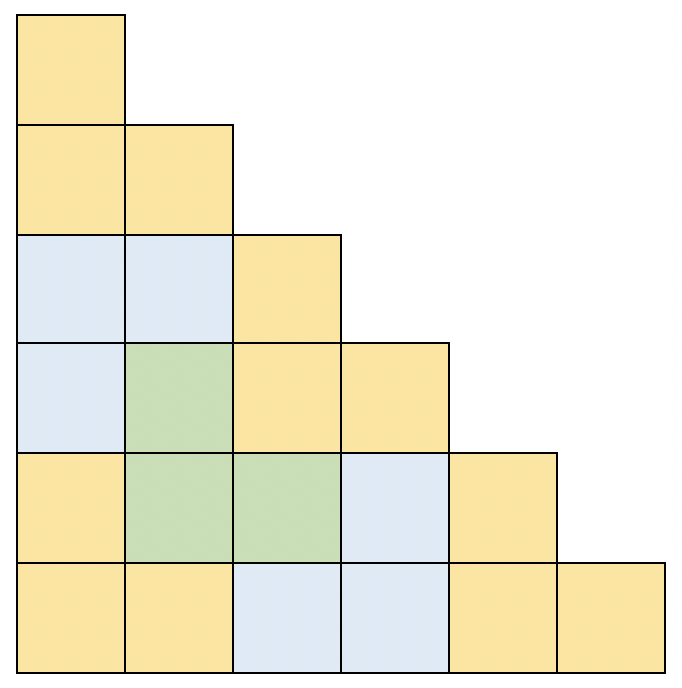
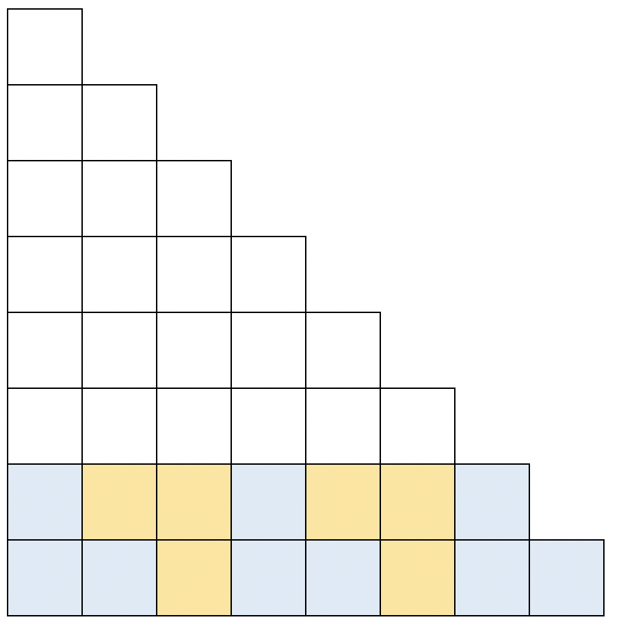
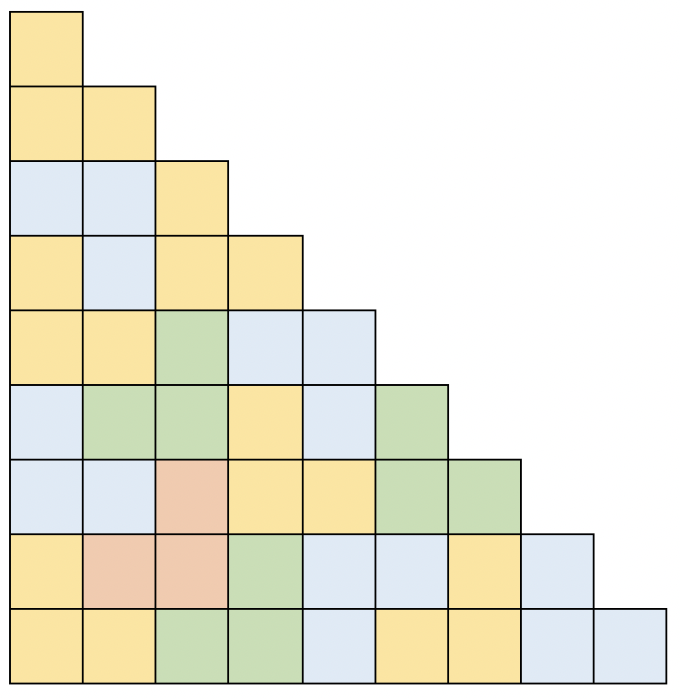
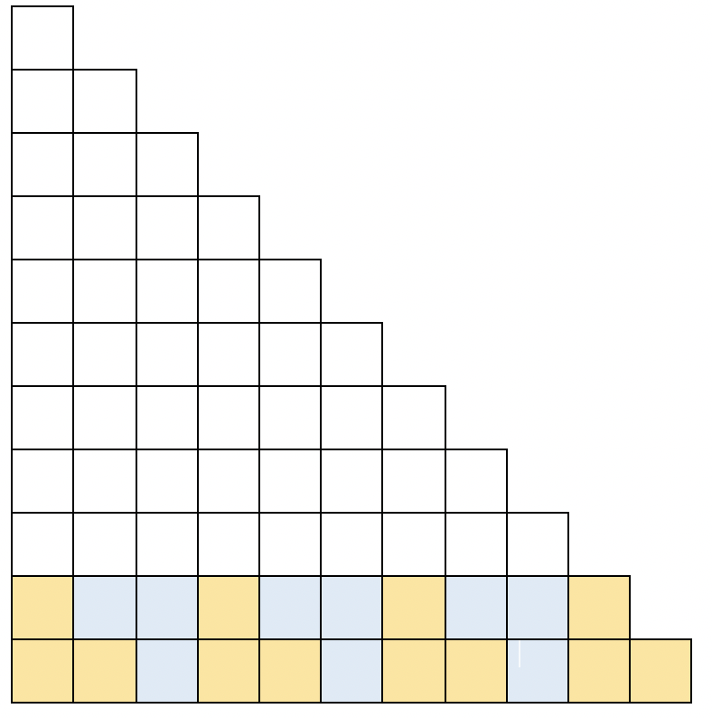
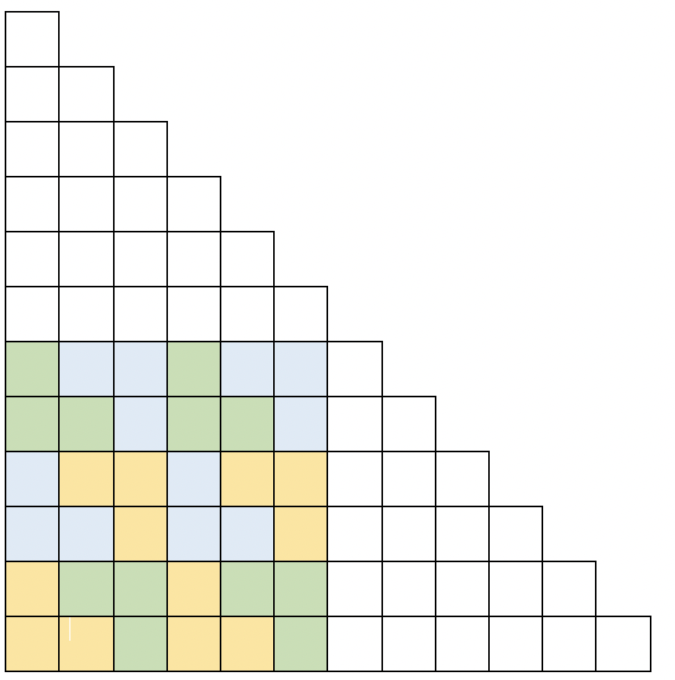

ถ้าวิเคราะห์ดี ๆ จะสังเกตได้ว่าเราจะไม่สามารถปูผนังได้ ถ้าจำนวนสี่เหลี่ยมหารด้วย 3 ไม่ลงตัว ดังนั้นเราจะไม่สามารถปูผนังได้เมื่อ $n = 4, 7$ เนื่องจากจำนวนสี่เหลี่ยมจะเท่ากับ $10, 28$ ตามลำดับ 

จากนั้นให้เราวิเคราะห์กรณีเล็ก ๆ จะได้ว่าเมื่อ $n = 1, 3, 5$ จะทำไม่ได้เช่นกัน

สำหรับ $n = 6$ เราจะสามารถปูผนังได้ดังรูป

เราสามารถต่อยอดการปูผนังสำหรับ $n = 6$ ไปเป็นการปูสำหรับ $n = 8$ ได้ ดังรูป (สังเกตว่า ช่องที่ขาวที่เว้นว่างไว้ จะตรงกับรูปผนังสำหรับ $n = 6$ พอดี)

สำหรับ $n = 9$ เราก็สามารถปูผนังได้ ตามรูป

และเราก็สามารถใช้เทคนิคเดียวกันเพื่อปู $n = 11$ ได้ ตามรูป

ที่เราสามารถใช้เทคนิคในการเปลี่ยนจาก $n$ ไปเป็น $n+2$ ได้นั้น เราอาศัยการที่ $3 \mid n$ เพื่อที่จะสามารถปูกระเบื้องที่ฐานได้

จากนั้นถ้าเราสังเกตดี ๆ เราสามารถเปลี่ยนจาก $n = 6$ เป็น $n = 12$ ได้ ดังรูป

สังเกตว่าสามเหลี่ยมด้านบนและด้านขวาคือรูปเดียวกันกับ $n = 6$ จากนั้นเราก็จะต้องปูผนังรูปสี่เหลี่ยมจัตุรัสขนาด $6 \times 6$

ถ้าสังเกตดี ๆ จะพบว่า เราสามารถเปลี่ยนจาก $n$ เป็น $n+6$ เมื่อ ได้ เมื่อ $3 | n$ โดยใช้เทคนิคนี้ โดยเราจะต้องปูกระเบื้องขนาด $6 \times 6$ ที่มุมขวาล่าง จากนั้นต้องปูผนังรูปสี่เหลี่ยมผืนผ้าขนาด $6 \times n$ ซึ่งสามารถทำได้เสมอเพราะ $n$ หารด้วย 3 ลงตัว (ยกตัวอย่างเช่น การปูสี่เหลี่ยมผืนผ้า $6 \times 9$ ให้เราใช้ของ $6 \times 6$ แล้วคัดลอก 3 หลักแรกไปต่อทางด้านขวามือ)

ดังนั้นเราสามารถสรุปการปูผนังที่เราเจอมาได้ดังนี้

- เราสามารถปูผนังได้ เมื่อ $n = 6, 9$
- ถ้าเราปูผนัง $n$ ได้ เราจะสามารถปูผนัง $n+2$ ได้ เมื่อ $3 \mid n$
- ถ้าเราปูผนัง $n$ ได้ เราจะสามารถปูผนัง $n+6$ ได้ เมื่อ $3 \mid n$

จากข้างต้น จะได้ว่าเราสามารถปูผนังสำหรับ $n = 6k, 6k+2, 6k+3, 6k+5$ เมื่อ $k \geq 1$ เสมอ และกรณีพิเศษอีกกรณีหนึ่งคือ $n = 2$

จากนั้นจะเหลือกรณี $n = 6k+1, 6k+4$ ที่เราจะพิสูจน์ว่าไม่สามารถปูผนังได้

กรณีแรก $n = 6k+1$ จำนวนสี่เหลี่ยมทั้งหมด = $n(n+1)/2 = (3k+1)(6k+1) = 18k^2 + 9k + 1$ เนื่องจาก $3 \mid 18k^2$ และ $3 \mid 9k$ ดังนั้น $3 \nmid n(n+1)/2$ เนื่องจากกระเบื้องหนึ่งชิ้นมีสี่เหลี่ยมสามรูป จึงไม่สามารถปูได้

กรณีที่สอง $n = 6k+4$ จำนวนสี่เหลี่ยมทั้งหมด = $n(n+1)/2 = (3k+2)(6k+5) = 18k^2 + 27k + 10$ ซึ่ง $3 \nmid n(n+1)/2$ ในทำนองเดียวกัน

ดังนั้นเราได้พิสูจน์และแสดงให้เห็นถึงการปูผนังทุก ๆ แบบที่เป็นไปได้แล้ว

เราจะได้อัลกอริทึมที่แก้ปัญหานี้ใน $\mathcal{O}(n^2)$