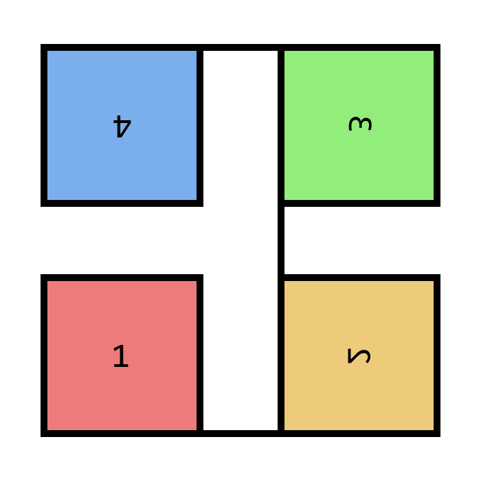
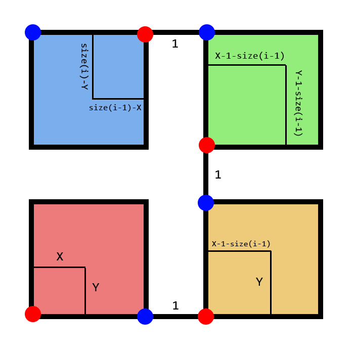

สำหรับคำถามประเภทแรก เราต้องการหาระยะทางจากจุด $(X, Y)$ ไปยังจุด $(0, 0)$ หรือจุดเริ่มต้น 

เราจะเริ่มจากการหา $i$ ที่น้อยที่สุดที่ $H(i)$ (Hilbert Curve ระดับชั้นที่ $i$) ครอบคลุมถึงจุด $(X, Y)$ โดยหาได้จากคุณสมบัติที่ว่า $H(i)$ มีขนาด $(2^i - 1) \times (2^i - 1)$

เราจะสามารถแบ่ง $H(i)$ ออกเป็น $H(i - 1)$ 4 อันดังภาพในโจทย์ (ต่อจากนี้จะเรียกว่า โซน) จากการที่เราเลือก $i$ ที่น้อยที่สุดแล้ว รับประกันได้ว่าจุด $(0, 0)$ และ $(X, Y)$ จะไม่อยู่ในโซนเดียวกัน

นอกจากนี้ สังเกตว่าระยะทางจากจุดเริ่มต้นไปยังจุดสิ้นสุดของ $H(k)$ จะมีค่าเท่ากับ $2^{2k} - 1$ เสมอ และจุด $(0, 0)$ เป็นจุดเริ่มต้นของ $H(i)$ ทำให้เราสามารถคำนวณระยะทางของโซนที่เราจำเป็นต้องเดินผ่านทั้งโซนนั้นได้เลย แล้วบวกด้วยระยะทางจากจุดเริ่มต้นของโซนที่มี $(X,Y)$ ไปถึงจุด $(X,Y)$ เอง

เราสามารถหาได้โดยใช้ Recursion หาระยะทางจากจุดเริ่มต้นไปยังจุด $(X', Y')$ ซึ่งมาจากการแปลงพิกัดของจุด $(X, Y)$ โดยสมมุติให้ให้จุดเริ่มต้นของโซนนั้นเป็นจุด $(0, 0)$

เนื่องจาก Recursion จะคิดระยะทางไล่จาก $H(i), H(i - 1), \dots, H(2), H(1)$ โดยมี $H(1)$ จะเป็น Base Case ที่เราสามารถตอบระยะทางได้ทันที จะได้

Time Complexity: $\mathcal{O}(\log (\max(X, Y)))$ ต่อหนึ่งคำถาม

สำหรับคำถามประเภทที่สอง เราต้องการหาพิกัดของจุดที่ห่างจากจุด $(0, 0)$ หรือจุดเริ่มต้น เป็นระยะ $K$

เราจะทำเช่นเดียวกันกับคำถามแรกคือหา $i$ ที่น้อยที่สุดที่ระยะทางในการเดินผ่าน $H(i)$ มีค่าอย่างน้อย $K$ ซึ่งหาได้จากคุณสมบัติที่ได้กล่าวไว้ในคำถามประเภทแรก

เมื่อทราบ $i$ แล้ว เราจะสามารถทราบได้ทันทีว่าพิกัดของคำตอบจะอยู่ในโซนไหน ผ่านการเทียบกับระยะทางที่ต้องเดินจากจุดเริ่มต้นไปยังโซนต่าง ๆ หากโซนใดที่เดินผ่านแล้วระยะทางยังไม่ถึง $K$ แสดงว่าจุดที่เป็นคำตอบไม่ได้อยู่ภายในโซนนั้น ทำให้เหลือเพียงหนึ่งโซนที่รับประกันได้ว่า จุดที่เป็นคำตอบต้องอยู่ในนั้น เราจะทำการ Recursive หาพิกัดของจุดที่เป็นคำตอบในโซนนั้นแทนโดยอ้างอิงจากระยะทาง $K'$ ซึ่งมาจากการหักระยะทางของโซนที่ต้องเดินผ่านแน่ๆ ออกจาก $K$

เนื่องจาก Recursion จะคิดระยะทางไล่จาก $H(i), H(i - 1), \dots, H(2), H(1)$ โดยมี $H(1)$ จะเป็น Base Case ที่เราสามารถตอบระยะทางได้ทันที จะได้

Time Complexity: $\mathcal{O}(\log K)$ ต่อหนึ่งคำถาม

ตัวอย่างการแปลงทางเรขาคณิตของ $H(i)$ กรณีที่ $i$ เป็นจำนวนเต็มคู่ และโจทย์ต้องการทราบระยะทางไปยังจุด $(X, Y)$

กำหนดให้ $size(i)$ คือขนาดของ $H(i)$

ฟังก์ชันในการคำนวณคำตอบ จะกำหนดให้จุดเริ่มต้นของ $H(i)$ อยู่ที่มุมล่างซ้ายเสมอ ดังนั้นสำหรับโซนที่มีจุดเริ่มต้นต่างไปจากนี้ จะต้องทำการแปลงทางเรขาคณิตก่อน ซึ่งสามารถแบ่งออกเป็น 4 กรณี ตามโซนที่จุด $(X, Y)$ อยู่ ดังนี้

1. โซนที่ 1 (สีแดง) จุดเริ่มต้นของโซนนี้ เป็นจุดเริ่มต้นเดียวกันกับ $H(i)$ จึงทำให้ $(X', Y') = (X, Y)$
2. โซนที่ 2 (สีเหลือง) ถึงแม้ว่าโซนนี้จะมีตำแหน่งจุดเริ่มต้น และจุดจบเหมือนกับ $H(i)$ แต่ $i - 1$ เป็นจำนวนเต็มคี่ ทำให้เราต้องสะท้อนบนล่างแล้วหมุนทวนเข็ม $90^{\circ}$ รอบจุดเริ่มต้น จึงทำให้ $(X', Y') = (Y, X - 1 - size(i - 1))$
3. โซนที่ 3 (สีเขียว) จะทำเหมือนกับโซนที่ 2 ทุกประการ เนื่องจากตำแหน่งจุดเริ่มต้น และจุดจบเหมือนกับโซนที่ 2 ทำให้ $(X', Y') = (Y - 1 - size(i - 1), X - 1 - size(i - 1))$
4. โซนที่ 4 (สีฟ้า) จุดเริ่มต้นอยู่มุมขวาบน และจุดจบอยู่มุมซ้ายบน ต้องหมุน $180^{\circ}$ รอบจุดเริ่มต้น จึงทำให้ $(X', Y') = (size(i - 1) - X, size(i) - Y)$

