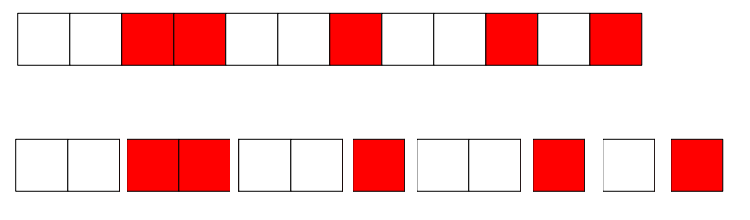

ในข้อนี้ กำหนดให้ช่องปกติเป็นช่องสีขาว และช่องเสื่อมสภาพเป็นช่องสีแดง

เราจะสามารถแบ่งช่องเหล่านี้ออกเป็นหลาย ๆ "partition" ได้ โดยแต่ละ partition จะเป็นช่องที่มีสีเดียวกันทั้งหมด สำหรับตัวอย่างแรกของโจทย์ เราจะสามารถแบ่ง partition ได้ดังรูปด้านล่างนี้

สังเกตว่าเราไม่จำเป็นต้องสนใจ partition ซ้ายสุดและขวาสุด หากเป็น partition สีขาว เนื่องจากไม่มีความจำเป็นที่ที่จะต้องนำผ้าใบมาคลุม partition เหล่านี้ ดังนั้นวิธีที่จะกล่าวต่อไปนี้ เราจะสนใจเพียง partition สีแดงอันแรก ไปจนถึง partition สีแดงอันสุดท้ายเท่านั้น

นอกจากนี้ สังเกตว่าหากเรามีผ้าทั้งหมด $K$ ผืน จะมี partition สีขาวที่ไม่ถูกคลุมอยู่ทั้งหมด $K - 1$ อัน เนื่องจากระหว่างผ้าสองผืนใด ๆ ที่วางถัดจากกัน จะมี partition สีขาวขั้นได้อย่างมากเพียง 1 อันเท่านั้น จึงทำให้เราสามารถเว้น partition สีขาวระหว่างผ้าแต่ละผืนได้มากที่สุดเพียง $K - 1$ อัน

เพื่อให้จำนวนช่องสีขาวที่ถูกคลุมน้อยที่ที่สุดที่เป็นไปได้ เราจึงควรเลือกวิธีที่ผลรวมของขนาด partition สีขาวที่ไม่โดนคลุม (กำหนดให้เป็นค่า $ans$) มีค่ามากที่สุด ซึ่งสามารถทำได้โดยการนำขนาดของ partition สีขาวมาเรียงจากมากไปน้อย และ $ans$ จะมีค่าเป็นผลรวมขนาดของ partition $K - 1$ อันแรก

เนื่องจากโจทย์ต้องการทราบจำนวนช่องสีขาวที่โดนคลุม จะได้ว่าคำตอบของข้อนี้คือ $N - ans$ (อย่าลืมว่าต้องลบขนาดของ partition สีขาวที่อยู่ซ้ายสุด และขวาสุดออกด้วย)

Time Complexity: $\mathcal{O}(N \log N)$