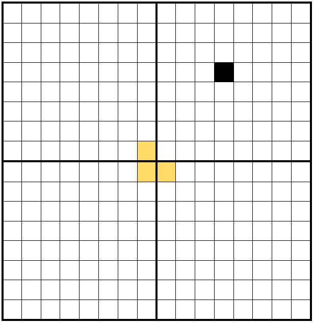
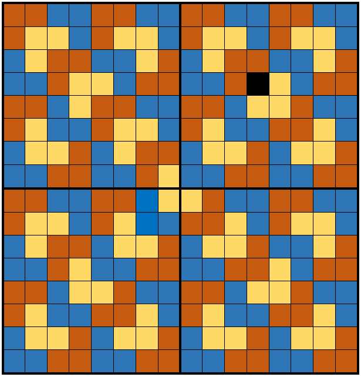

โจทย์ข้อนี้เป็นโจทย์เกี่ยวกับการอุปนัยทางคณิตศาสตร์ (Mathematical Induction) ที่พบเห็นค่อนข้างบ่อย แต่มีความยากเพิ่มเติมคือต้องใส่สีให้ไม่มีสีเดียวกันอยู่ติดกัน

ก่อนอื่น พิจารณาวิธีวางกระเบื้องโดยไม่ใส่สี สังเกตว่าเราสามารถปูกระเบื้องกรณีที่ส่วนมีขนาด $2^1 \times 2^1$ ได้เสมอ

สำหรับกรณีที่สวนมีขนาด $2^n \times 2^n$ เมื่อ $n > 1$ สามารถปูได้โดยแบ่งสวนออกเป็นสี่ส่วน เมื่อวางกระเบื้องหนึ่งแผ่นไว้ตรงกลางโดยจัดทิศทางให้ถูกต้อง จะเห็นได้ว่าทั้ง 4 ส่วนคือปัญหาการวางกระเบื้องสำหรับสวนขนาด $2^{n-1} \times 2^{n-1}$ ที่มีช่องห้ามวางกระเบื้องหนึ่งช่อง เหมือนกับปัญหาเดิม ดังนี้



ดังนั้น หากเขียนวิธีการวางกระเบื้องด้วย recursion โดยระบุให้ argument เป็นขอบเขตของส่วนที่พิจารณาปูกระเบื้องอยู่และพิกัดของช่องที่ห้ามวางกระเบื้อง ในแต่ละขั้นเราสามารถทำการวางกระเบื้องหนึ่งแผ่นตรงกลางแล้วส่งต่อให้ recursive mechanism จัดการจนถึง base case ขนาด $2^1 \times 2^1$ ซึ่งทำให้เราสามารถวางกระเบื้องได้ทั้งสวน

ต่อมา พิจารณาการลงสี สังเกตว่ากระเบื้องที่อยู่ตรงกลางในแต่ละรอบจะอยู่ติดกับกระเบื้องอีกสี่แผ่นที่ล้อมรอบเป็นรูปสี่เหลี่ยม ในกระเบื้องสี่แผ่นนั้นไม่มีส่วนที่อยู่ติดกันพร้อมกันสามแผ่น ดังนั้นสามารถลงสีกระเบื้องสี่แผ่นนั้นได้ด้วยเพียง 2 สีเสมอ ดังนั้นกระเบื้องตรงกลางจำเป็นต้องเป็นสีที่ 3

ดังนั้น วิธีการลงสีที่ดีที่สุดคือการลงสีใน base case ด้วยสองสีสลับกันไป แล้วใช้สีที่ 3 สำหรับกระเบื้องแผ่นตรงกลางของ recursion ทุกขั้น ดังภาพ



## Implementation

ในภาษา C++:

```cpp
#include <bits/stdc++.h>
using namespace std;

void solve(int n, int x, int y, int x1, int y1, int x2, int y2) {
  if (n == 1) {
    int t = 1;
    if (x2 == x)
      ++t;
    if (y2 == y)
      t += 2;
    int c = ((x2 / 2 + y2 / 2) % 2 == 0) ? 1 : 2;
    printf("%d %d %d %d\n", t, c, x1, y1);
    return;
  }
  int xm = (x1 + x2) / 2;
  int ym = (y1 + y2) / 2;
  int X[] = {xm, xm + 1, xm, xm + 1};
  int Y[] = {ym, ym, ym + 1, ym + 1};
  int X1[] = {x1, xm + 1, x1, xm + 1};
  int Y1[] = {y1, y1, ym + 1, ym + 1};
  int X2[] = {xm, x2, xm, x2};
  int Y2[] = {ym, ym, y2, y2};
  for (int i = 0; i < 4; ++i) {
    if (x >= X1[i] && x <= X2[i] && y >= Y1[i] && y <= Y2[i]) {
      printf("%d %d %d %d\n", i + 1, 3, xm, ym);
      solve(n - 1, x, y, X1[i], Y1[i], X2[i], Y2[i]);
    } else {
      solve(n - 1, X[i], Y[i], X1[i], Y1[i], X2[i], Y2[i]);
    }
  }
}

int main() {
  int n, x, y;
  scanf("%d%d%d", &n, &x, &y);
  solve(n, x, y, 1, 1, 1 << n, 1 << n);

  return 0;
}
```
