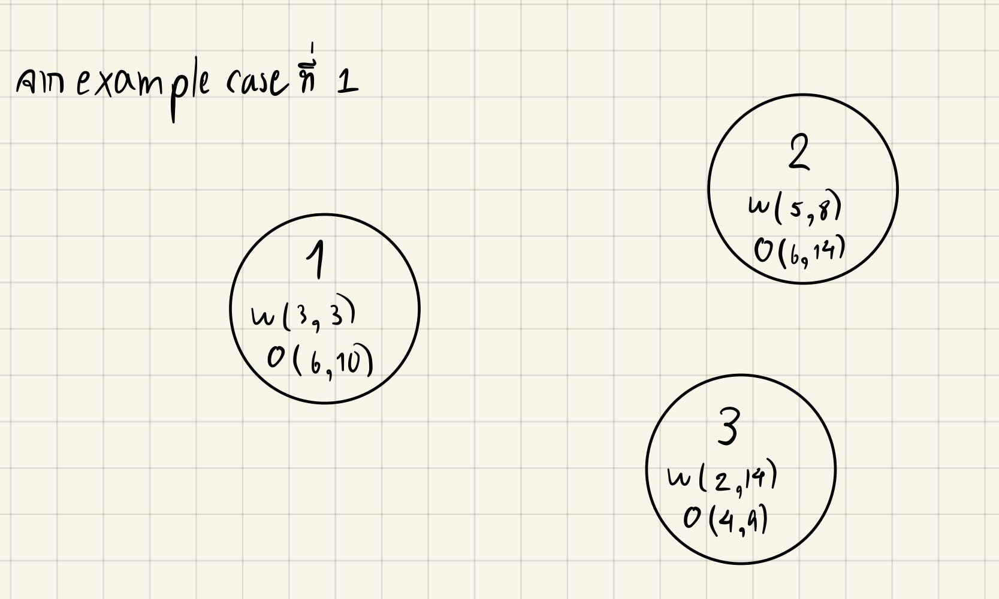
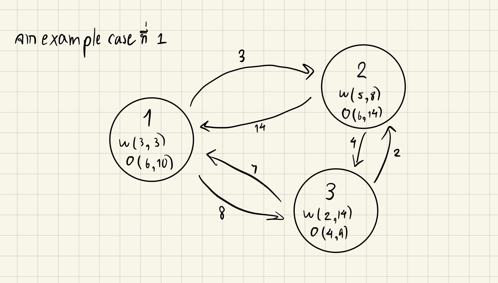
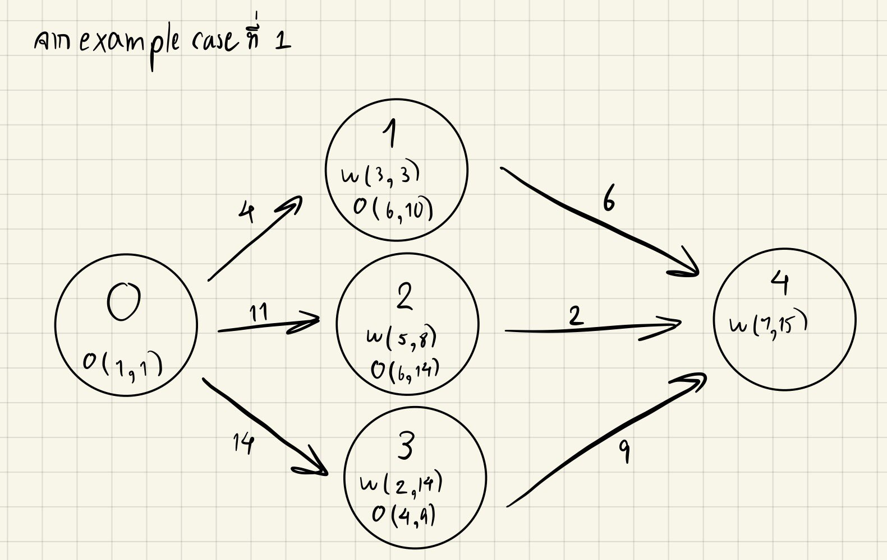

เพื่อความเข้าใจที่ตรงกันหลังจากนี้จะใช้ชื่อตัวแปรตามโจทย์กล่าวคือ  
- จำนวนแถวของตารางเท่ากับ $M$  
- จำนวนคอลัมน์เท่ากับ $N$ 
- จำนวนจุดยอดเท่ากับ $K$ 
- และจำนวนตั๋วเท่ากับ $P$   

# วิเคราะห์ปัญหา
ในข้อนี้เราสามารถมองแต่ละจุดวาร์ปเป็นจุดยอดบนกราฟได้ โดยจะรวมจุดวาร์ปเข้า $(w_i)$ และจุดวาร์ปออก $(o_i)$ เป็นจุดยอดเดียวกัน (รวมเป็น $point_i$) (สามารถดูภาพประกอบที่ 1 เพื่อความเข้าใจ) 

โดยแต่ละจุดยอดจะเก็บพิกัดของจุดวาร์ปเข้าและออก ซึ่งจะได้เป็น struct ดังด้านล่าง

``` cpp
struct Point {
    int w_r, w_c, o_r, o_c; // Attrubute -> position of warp point
    Point(int a, int b, int c, int d) { // Constructor
        w_r = a, w_c = b, o_r = c, o_c = d;
    }
};
```

<!-- Add pic1 -->


เราสร้างเส้นเชื่อมจาก node u ไป node v มีน้ำหนักเท่ากับ**ระยะทางจากทางออกของ u ไปยังทางเข้าของ v** ซึ่งจะได้เป็นสมการ $$dis(u, v) = abs(u.or - v.wr) + abs(u.oc - v.wc)$$   
(สังเกตได้ว่าระยะทางจาก u ไป v อาจไม่เท่ากับ v ไป u ก็เป็นได้ $dis(u, v) \neq dis(v, u)$ ทำให้กราฟนี้เป็น **Directed Graph**)   

เนื่องจากเราสามารถเดินจากจุดวาร์ปใดๆไปอีกจุดได้อย่างอิสระทำให้จุดยอดแต่ละจุดมีเส้นเชื่อมไปหาทุกจุดยอดบนกราฟ ทำให้กราฟนี้เป็น **Complete Graph** ด้วย ซึ่งมีจำนวนเส้นเชื่อมทั้งหมด $K*(K-1) \approx K^2$ เมื่อ $K$ คือจำนวนจุดยอด

<!-- Add pic where each node has edges -->


เพื่อความง่ายเราจะทำการเพิ่มจุดยอดจุดที่ $0$ แทนจุดเริ่มต้นซึ่งมีพิกัดจุดวาร์ปออกเป็น $o_0 = (1, 1)$ โดยมีเส้นเชื่อมไปหาทุกจุดยอด  และเพิ่มจุดยอดที่ $K+1$ แทนจุดสิ้นสุดซึ่งมีพิกัดจุดวาร์ปเข้าเป็น $w_{K+1} = (M, N)$ โดยที่ทุกจุดยอดจะมีเส้นเชื่อมเข้ามาหาจุดที่ $K+1$ 

  
(ในรูปจะวาดเพียงเส้นเชื่อมจากจุดยอดที่เกี่ยวข้องกับจุดยอดที่ 0 และ K+1 เท่านั้นเพื่อความเข้าใจ)

ทั้งหมดนี้ทำให้เราย่อยปัญหาได้เป็นการหาระยะทางสั้นสุดจากจุดที่ $0$ ไปจุดที่ $K+1$ และเป็นที่แน่นอนว่าเราจะต้องใช้อัลกอริทึมยอดนิยมอย่าง Dijkstra Algorithm ซึ่งสามารถทำงานได้ใน $\mathcal{O}(V+ElogE)$  แต่ในข้อนี้มีตั๋วเข้ามาเกี่ยวข้องทำให้จำนวนจุดยอดจริงๆเท่ากับ $P*K$ เมื่อ $P$ คือจำนวนตั๋วที่มากที่สุดที่เป็นไปได้
อย่างไรก็ดีการมี $K^2$ 
เส้นเชื่อม ทำให้ Dijkstra ทำงาน $\mathcal{O}(PK^2logPK)$ ซึ่งเราสามารถทำได้ดีกว่านี้โดยการใช้ **Dynamic Programming** แทน  
(หากไม่เข้าใจว่าทำไมถึงมี $P*K$ จุดยอดสามารถอ่านที่ลิ้งนี้ได้ครับ  
https://medium.com/@weeklycpproblems/tips-tricks-for-toi-ep-1-dijkstra-shortest-path-de30ed55c9a1)
  

# แก้ปัญหา

นิยาม $dp(t, i)$ คือ ระยะทางที่สั้นที่สุดจากจุดเริ่มต้นมายังจุดวาร์ป $i$ โดยใช้ตั๋วไปแล้วทั้งหมด $t$ ใบ (ใช้ตั๋ววาร์ปกับจุดที่ $i$ ไปแล้วทำให้ตอนนี้อยู่ที่จุดวาร์ปออกที่ $i$) จะได้  
$$dp(t, i) = \begin{cases}
\min(dp(t-1, j) + dis(j, i)) & \text{; } t\geq2 \text{ and } 1 \leq j \leq K \\
dis(0, i) & \text{; } t = 1
\end{cases}$$

*คำอธิบายสมการแรก* การมาถึงจุดที่ $i$ โดยใช้ตั๋วไปแล้ว $t$ ใบสามารถมาได้จากจุดวาร์ป $j$ ใดๆก็ได้ที่ใช้ตั๋วไปแล้้ว $t-1$ ใบ แล้วบวกด้วยระยะทางจากจุด $j$ มายังจุด $i$  
*คำอธิบายสมการที่สอง* หากเราพึ่งใช้ตั๋วเป็นครั้งแรก $(t=1)$ แสดงว่าเราต้อง**เดิน**มาจากจุดเริ่มต้น (จุดที่ $0$) เท่านั้น


``` cpp
void solve() {    
    for (int i = 1; i <= K; i++) dp[1][i] = dis(0, i);

    for (int t = 2; t <= P; t++){
        for (int i = 1; i <= K; i++) {
            dp[t][i] = INF; // INF = 1e9+10
            for(int j = 1; j <= K; j++) {
                dp[t][i] = min(dp[t][i], dp[t-1][j] + dis(j, i));
            }
        }
    }
}
```

เราจะนิยาม $mn_{dis}$ คือระยะทางที่น้อยที่สุดในการมาถึงจุดสิ้นสุดซึ่งจะได้เป็นสมการด้านล่าง
$$mn_{dis} = \min \begin{cases} 
M+N-2 \\
dp(t, i)+dis(i, K+1) & \text{; } 1 \leq t \leq P \text{ and } 1 \leq i \leq K
\end{cases}$$
*คำอธิบายสมการแรก* หากเราเดินตรงๆโดยไม่เข้าจุดวาร์ปใดเลยจะต้องเดินลงทั้งหมด $M-1$ ก้าวเสมอ และต้องเดินไปทางขวา $N-1$ ก้าวทำให้ต้องเดินทั้งหมด $(M-1)+(N-1) = M+N-2$ ก้าว  
*คำอธิบายสมการที่สอง* เราสามารถเดินออกจากทางออกของจุดวาร์ปใดๆก็ได้มายังจุดสิ้นสุด (จุดที่ $K+1$)

``` cpp
void get_ans(int &mn_dis, int &mn_ticket) {
    for (int t = 1; t <= P; t++) {
        for (int i = 1; i <= K; i++) {
            int cur_cost = dp[t][i] + dis(i, K+1);
            if (cur_cost < mn_dis) {
                mn_dis = cur_cost;
                mn_ticket = t;
            }
        }
    }
}
```


***Time Complexity:*** $\mathcal{O}(PK^2)$  
***Space Complexity:*** $\mathcal{O}(PK)$

# Code
``` cpp
#include <bits/stdc++.h>
using namespace std;


const int MXP = 20, MXK = 2e4+10, INF = 1e9+10;
int M, N, K, P;
int dp[MXP][MXK];


struct Point {
    int w_r, w_c, o_r, o_c; // Attrubute -> position of warp point
    Point(int a, int b, int c, int d) { // Constructor
        w_r = a, w_c = b, o_r = c, o_c = d;
    }
};
vector<Point> points;


int dis(int, int);
void solve();
void get_ans(int &, int &);


int main(void) {
    ios_base::sync_with_stdio(0); cin.tie(0);
    
    cin >> M >> N >> K >> P;
    points.push_back(Point(-1, -1, 1, 1));
    for (int i = 1; i <= K; i++) {
        int w_r, w_c, o_r, o_c;
        cin >> w_r >> w_c >> o_r >> o_c;
        points.push_back(Point(w_r, w_c, o_r, o_c));
    }
    points.push_back(Point(M, N, -1, -1));

    int mn_dis = M+N-2;
    int mn_ticket = 0;

    solve();
    get_ans(mn_dis, mn_ticket);
    
    cout << mn_dis << " " << mn_ticket << "\n";

    return 0;
}


int dis(int a, int b) {
    return abs(points[a].o_r-points[b].w_r) + abs(points[a].o_c-points[b].w_c);
}


void solve() {    
    for (int i = 1; i <= K; i++) dp[1][i] = dis(0, i);

    for (int t = 2; t <= P; t++){
        for (int i = 1; i <= K; i++) {
            dp[t][i] = INF; // INF = 1e9+10
            for(int j = 1; j <= K; j++) {
                dp[t][i] = min(dp[t][i], dp[t-1][j] + dis(j, i));
            }
        }
    }
}


void get_ans(int &mn_dis, int &mn_ticket) {
    for (int t = 1; t <= P; t++) {
        for (int i = 1; i <= K; i++) {
            int cur_cost = dp[t][i] + dis(i, K+1);
            if (cur_cost < mn_dis) {
                mn_dis = cur_cost;
                mn_ticket = t;
            }
        }
    }
}

```
