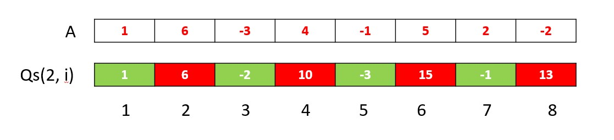

# Observation
* เราสามารถสังเกตได้ว่าในทุกๆคำถาม index ของ Array ที่ใช้คิด Sum จะมีผลหารด้วยค่า $M$ เท่ากันทั้งหมด เนื่องจาก $(L+KM)\%M \equiv (L\%M + KM\%M) \equiv L\%M$  
* เราจะสังเกตได้ว่าหากค่า $M$ น้อย จำนวนเศษที่แตกต่างกันที่ได้จากการด้วย $M$ ก็จะน้อยตามไปด้วย  
* ถ้าหากเราเจอหลายคำถามที่ค่า $M$ เท่ากัน และ $L_{i}\%M$ เท่ากันด้วย เราจะสามารถ Precompute Quicksum เพื่อมาตอบได้ใน $\mathcal{O}(1)$ เช่น $L_{1} = 7, M_{1} = 3, R_{1} = 71$ และ $L_{2} = 46, M_{2} = 3, R_{2} = 99$
คำถามที่ 1 จะใช้ index ดังต่อไปนี้ $7, 10, 13, ..., 70$ และคำถามที่ 2 จะใช้ index $46, 49, 52, ..., 97$ ซึ่งจะมีบางส่วนที่ซ้อนทับกันทำให้เราสามารถคิด Quicksum ล่วงหน้าเพื่อมาตอบทั้งสองคำถามนี้ได้


# Approach 1

สำหรับข้อนี้ หากเราเราตอบแต่ละคำถามโดยการไล่ loop ตรงๆดังโค้ดด้านล่าง
```cpp
int sum = 0;
for (int i = l; i <= r; i += m) sum += arr[i];
cout << sum << " ";
```
จะใช้เวลา $\mathcal{O}(\frac{N}{M})$ ซึ่งใช้เวลาแปรผกผันกับ $M$ กล่าวคือหาก $M$ มีค่าน้อยจะใช้เวลามาก และหาก $M$ มีค่ามากก็จะใช้เวลาน้อย ซึ่งถ้าเราเจอคำถามที่มีค่า $M$ น้อยหลายๆครั้งจะทำให้ใช้เวลา $\mathcal{O}(QN)$ ซึ่งใช้เวลานานเกินไป

# Approach 2

แต่ถ้าหากเราคิด Quicksum ไว้ล่วงหน้าเพื่อตอบแต่ละคำถามใน $\mathcal{O}(1)$ โดยเราจะสังเกตได้ว่าเราสามารถคิด Quicksum ดังสมการด้านล่างได้
$$qs(M, i) = \begin{cases}
 qs(M, i-M) + A[i] & \text{; }i-M > 0 \\
 A[i] & \text{; otherwise}
 \end{cases}$$

 กล่าวคือเราจะให้แต่ละช่องเก็บเฉพาะผลรวมของช่องที่ $j\%M \equiv i\%M และ j < i$ ตัวอย่างดังรูปด้านล่าง

 สมมติว่า $N = 8$ และ $A = [1, 6, -3, 4, -1, 5, 2, -2]$
 

และสามารถหาผลรวมเพื่อตอบแต่ละคำถามได้โดยใช้สมการด้านล่าง
กำหนดให้คำถามมีค่า $L, M, R$ เราจะหาค่า $K$ ที่มากที่สุดที่ $L+KM \leq R$ ด้วยการย้ายข้างสมการ จะได้ $K = \lfloor \frac{R-L}{M} \rfloor$
$$sum(L, M, R)=\begin{cases}
qs(M, L+kM) - qs(M, L-M) & \text{; L - M > 0}\\
qs(M, L+kM) & \text{; otherwise}
\end{cases}
$$

แต่การทำแบบนี้จะทำให้ต้องคิดค่า Quicksum ล่วงหน้าสำหรับ ทุกๆ $M$ ทำให้มีทั้งหมด $N$ อัน และแต่ละอันใช้เวลา $\mathcal{O}(N)$ ทำให้ใช้เวลา Precompute Quicksum ล่วงหน้าทั้งหมดเท่ากับ $\mathcal{O}(N^2)$ ซึ่งใช้เวลานานเกินไป

# แก้ปัญหา

 เราจะใช้เทคนิค Square Root Decomposition มาช่วยในการแก้ปัญหาข้อนี้ (สามารถศึกษาจากคลิปนี้ได้ https://youtu.be/BJhzd_VG61k) กล่าวคือเราจะแบ่งวิธีการตอบแต่ละคำถามเป็น 2 วิธี  
 วิธีแรกสำหรับคำถามที่ใช้เวลา loop มาก(ค่า $M_{i}$ น้อย) และวิธีที่สองสำหรับคำถามที่ใช้เวลา loop น้อย(ค่า $M_{i}$ มาก) ซึ่งเราจะบอกว่าค่า $M_{i}$ น้อยก็ต่อเมื่อ $M_{i} \leq \sqrt{N}$ มิฉะนั้นจะเรียกค่า $M_{i}$ ว่ามีค่ามาก

 สำหรับ $M_{i}$ มากเราจะสามารถ for loop ตรงๆได้ เนื่องจากการ loop จะใช้เวลา $\mathcal{O}(\frac{N}{M_{i}})$ แต่เนื่องจาก $M_{i} > \sqrt{N}$ ทำให้ $\frac{N}{M_{i}} = \frac{N}{\sqrt{N}} = \sqrt{N}$ หรือก็คือใช้เวลา $\mathcal{O}(\sqrt{N})$ ต่อหนึ่งคำถาม และใช้เวลาไม่เกิน $\mathcal{O}(Q\sqrt{N})$ เมื่อ $Q$ คือจำนวนคำถาม ตัวอย่างดังโค้ดด้านล่าง

```cpp
if (m > SQ) {
    int sum = 0;
    for (int i = l; i <= r; i += m) sum += arr[i];
    cout << sum << " ";
}
```

 สำหรับค่า $M_{i}$ น้อยเราจะคิด Quicksum ไว้ล่วงหน้าเพื่อตอบแต่ละคำถามใน $\mathcal{O}(1)$ ซึ่งเราจะต้อง Quicksum สำหรับทุกๆค่า $M$ ที่ $M \leq \sqrt{N}$ โดยในแต่ละรอบของการคิด Quicksum จะใช้เวลา $\mathcal{O}(N)$ และต้องทำทั้งหมด $\sqrt{N}$ รอบ ซึ่งจะใช้เวลา $\mathcal{O}(N\sqrt{N})$ ในการคิด Quicksum สำหรับทุกค่าของ M ที่ **น้อย** และใช้เวลาไม่เกิน $\mathcal{O}(N\sqrt{N} + Q)$ ตัวอย่างดังโค้ดด้านล่าง

```cpp
int qs[MXSQ][MXN] = {}, SQ;
void PreProcess(int N, vector<int> arr) {
    SQ = 1+sqrt(N);
    for (int sz = 1; sz <= SQ; sz++) {
        for (int i = 1; i <= N; i++) {
            qs[sz][i] = qs[sz][max(0, i-sz)] + arr[i];
        }
    }
}

int get_sum(int l, int m, int r) {
    int k = (r-l)/m;
    return qs[m][l+m*k] - qs[m][max(0, l-m)];
}
```

 สุดท้ายนี้เราก็นำทั้ง 2 กรณีมารวมกัน(แยกเคสกันด้วย if) ซึ่งจะใช้เวลาเท่ากับ $\mathcal{O}(Q\sqrt{N} + N\sqrt{N} + Q) = \mathcal{O}(Q\sqrt{N} + N\sqrt{N})$

 # Code
```cpp
// Sqrt decomposition (Precalculate sum for m <= sqrt(n), otherwise loops to get sum)
// Author: JO
// Date: 6/5/2022

#include <bits/stdc++.h>
using namespace std;

const int MXN = 1e5+10;
const int MXSQ = 320;
int qs[MXSQ][MXN] = {}, SQ;

void PreProcess(int N, vector<int> arr) {
    SQ = 1+sqrt(N);
    for (int sz = 1; sz <= SQ; sz++) {
        for (int i = 1; i <= N; i++) {
            qs[sz][i] = qs[sz][max(0, i-sz)] + arr[i];
        }
    }
}

int get_sum(int l, int m, int r) {
    int k = (r-l)/m;
    return qs[m][l+m*k] - qs[m][max(0, l-m)];
}

int main(void) {
    ios_base::sync_with_stdio(0); cin.tie(0);
    int N, Q; cin >> N >> Q;
    vector<int> arr(N+5);
    for (int i = 1; i <= N; i++) cin >> arr[i];

    PreProcess(N, arr);

    while (Q--) {
        int l, m, r; cin >> l >> m >> r;

        if (m <= SQ) {
            cout << get_sum(l, m, r) << " ";
        } else {
            int sum = 0;
            for (int i = l; i <= r; i += m) sum += arr[i];
            cout << sum << " ";
        }
    }

    return 0;
}
```